# Catálogo 03.14 — Cascade Dependency Graph

> **AUTO-GENERADO** desde `shared/lib/intelligence-engine/cascades/dependency-graph.ts`.
> No editar a mano. Regenerar con `npm run cascades:export`.
>
> Última actualización: 2026-04-21

## Resumen

- Cascadas totales: **14**
- Edges totales: **53**
- Scores únicos afectados: **39**

## Diagrama (mermaid)

```mermaid
flowchart LR
  unit_sold[unit_sold] --> B08[B08]
  unit_sold[unit_sold] --> E01[E01]
  unit_sold[unit_sold] --> D02[D02]
  unit_sold[unit_sold] --> B03[B03]
  unit_sold[unit_sold] --> B09[B09]
  price_changed[price_changed] --> A12[A12]
  price_changed[price_changed] --> A01[A01]
  price_changed[price_changed] --> A04[A04]
  price_changed[price_changed] --> A02[A02]
  price_changed[price_changed] --> B02[B02]
  price_changed[price_changed] --> B03[B03]
  price_changed[price_changed] --> E01[E01]
  macro_updated[macro_updated] --> A01[A01]
  macro_updated[macro_updated] --> A03[A03]
  macro_updated[macro_updated] --> A04[A04]
  macro_updated[macro_updated] --> A05[A05]
  macro_updated[macro_updated] --> B02[B02]
  macro_updated[macro_updated] --> B12[B12]
  macro_updated[macro_updated] --> D01[D01]
  macro_updated[macro_updated] --> C05[C05]
  feedback_registered[feedback_registered] --> B04[B04]
  feedback_registered[feedback_registered] --> B03[B03]
  feedback_registered[feedback_registered] --> C04[C04]
  search_behavior[search_behavior] --> B01[B01]
  search_behavior[search_behavior] --> B04[B04]
  search_behavior[search_behavior] --> H14[H14]
  geo_denue[geo_data_updated:denue] --> F03[F03]
  geo_denue[geo_data_updated:denue] --> N01[N01]
  geo_denue[geo_data_updated:denue] --> N02[N02]
  geo_denue[geo_data_updated:denue] --> N03[N03]
  geo_denue[geo_data_updated:denue] --> N08[N08]
  geo_denue[geo_data_updated:denue] --> N09[N09]
  geo_denue[geo_data_updated:denue] --> N10[N10]
  geo_fgj[geo_data_updated:fgj] --> F01[F01]
  geo_fgj[geo_data_updated:fgj] --> N04[N04]
  geo_fgj[geo_data_updated:fgj] --> N09[N09]
  geo_gtfs[geo_data_updated:gtfs] --> F02[F02]
  geo_gtfs[geo_data_updated:gtfs] --> N02[N02]
  geo_gtfs[geo_data_updated:gtfs] --> N05[N05]
  geo_gtfs[geo_data_updated:gtfs] --> N08[N08]
  geo_siged[geo_data_updated:siged] --> H01[H01]
  geo_siged[geo_data_updated:siged] --> N06[N06]
  geo_siged[geo_data_updated:siged] --> N10[N10]
  geo_dgis[geo_data_updated:dgis] --> H02[H02]
  geo_dgis[geo_data_updated:dgis] --> N10[N10]
  geo_sacmex[geo_data_updated:sacmex] --> F05[F05]
  geo_sacmex[geo_data_updated:sacmex] --> N07[N07]
  geo_sacmex[geo_data_updated:sacmex] --> H10[H10]
  geo_sacmex[geo_data_updated:sacmex] --> N05[N05]
  geo_atlas_riesgos[geo_data_updated:atlas_riesgos] --> H03[H03]
  geo_atlas_riesgos[geo_data_updated:atlas_riesgos] --> N05[N05]
  geo_rama[geo_data_updated:rama] --> F04[F04]
  geo_inah[geo_data_updated:inah] --> H08[H08]
```



## JSON completo

```json
{
  "unit_sold": [
    "B08",
    "E01",
    "D02",
    "B03",
    "B09"
  ],
  "price_changed": [
    "A12",
    "A01",
    "A04",
    "A02",
    "B02",
    "B03",
    "E01"
  ],
  "macro_updated": [
    "A01",
    "A03",
    "A04",
    "A05",
    "B02",
    "B12",
    "D01",
    "C05"
  ],
  "feedback_registered": [
    "B04",
    "B03",
    "C04"
  ],
  "search_behavior": [
    "B01",
    "B04",
    "H14"
  ],
  "geo_data_updated": {
    "denue": [
      "F03",
      "N01",
      "N02",
      "N03",
      "N08",
      "N09",
      "N10"
    ],
    "fgj": [
      "F01",
      "N04",
      "N09"
    ],
    "gtfs": [
      "F02",
      "N02",
      "N05",
      "N08"
    ],
    "siged": [
      "H01",
      "N06",
      "N10"
    ],
    "dgis": [
      "H02",
      "N10"
    ],
    "sacmex": [
      "F05",
      "N07",
      "H10",
      "N05"
    ],
    "atlas_riesgos": [
      "H03",
      "N05"
    ],
    "rama": [
      "F04"
    ],
    "inah": [
      "H08"
    ]
  }
}
```

## Referencias

- ADR-010 §D7 — Las 6 cascadas formales
- shared/lib/intelligence-engine/cascades/dependency-graph.ts
- app/api/admin/cascades/graph/route.ts (superadmin endpoint runtime)

---

## APPEND v3 onyx-benchmarked (2026-04-28) — 8 cascadas nuevas FASE 15 + FASE 18

**Autoritativos:** [ADR-060](../01_DECISIONES_ARQUITECTONICAS/ADR-060_FASE_15_BUCKET_B_ONYX_BENCHMARKED_INTEGRATION.md), [ADR-061](../01_DECISIONES_ARQUITECTONICAS/ADR-061_FASE_18_M21_AFTER_SALES_DEDICATED.md).

### FASE 15 Bucket B — 5 cascadas nuevas

| Cascade | Trigger | Effects | Memoria |
|---|---|---|---|
| `lead_touchpoint_change` | INSERT/UPDATE `lead_touchpoints` | debounced 30s → recompute `lead_scores` → if score crosses 85 → notif type 17 + journey_executions trigger | B.6 |
| `lead_score_threshold` | UPDATE `lead_scores.score` crosses 85 | INSERT `journey_executions` (templates "hot lead alert") + notif type 17 SLA <5min | B.6 → B.7 |
| `worksheet_approve` | UPDATE `unit_worksheets.status='approved'` | UPDATE `unidades.status='reservada'` + INSERT `operaciones` pre-stage='interesado' + notif type 20 | B.1 → M07 (CF.1) |
| `worksheet_reject_or_expire` | UPDATE `unit_worksheets.status='rejected'/'expired'` | UPDATE `unidades.status='disponible'` + notif type 20 | B.1 |
| `operacion_oferta_stage` | UPDATE `operaciones.stage='oferta'` | INSERT `contracts.draft` con smart pre-fill desde unidades + esquemas_pago + asesores.comision_pct + IVA | M07 → B.3 (CF.1) |

### FASE 18 M21 After-Sales — 3 cascadas nuevas

| Cascade | Trigger | Effects | Bloque |
|---|---|---|---|
| `operacion_close_postsale_invite` | UPDATE `operaciones.stage='cerrada'` AND `has_cfdi=true` | INSERT ghost `profiles` role='comprador_postventa' + magic link email/WA | 18.A |
| `finishes_selection_confirmed` | UPDATE `finishes_selections.status='confirmed'` | INSERT `fiscal_docs.status='pending_finishes_emit'` + cron emit Facturapi 5min → email cliente PDF | 18.B |
| `inspection_fail_auto_workorder` | INSERT `inspection_items.status='fail'` (critical) | INSERT `work_orders` auto-assigned subcontratista by specialty | 18.C → 18.D |

**Total cascadas nuevas H1 forward: 8 (5 FASE 15 + 3 FASE 18). Todas testeadas pre-tag con Vitest unit + Playwright e2e cross-portal.**

**Status v3:** Shipped post-tags `fase-15-onyx-benchmarked` + `fase-18-after-sales-complete`.
