# Catálogo 03.15 — Score Lineage Graph

> **AUTO-GENERADO** desde `shared/lib/intelligence-engine/registry.ts`.
> No editar a mano. Regenerar con `npm run scores:lineage-export`.
>
> Última actualización: 2026-04-21 (FASE 11 XL — 8 índices nuevos + 6 señales derivadas agregadas manualmente, regeneración auto post-commit FASE 11 XL)

## Resumen

- Total entregables: **139** (118 scores + 15 índices DMX + 6 señales derivadas FASE 11 XL)
- Scores con dependencies: **50** (pre-FASE 11 XL)
- Max upstream depth: **6** (pre-FASE 11 XL; post-FASE 11 XL Causal Engine lee *todos* los scores → depth irrelevante para lineage técnico)
- Scores hoja (sin downstream): **59**
- Índices FASE 11 XL originales (7) + nuevos (8) = **15 índices DMX**
- Señales derivadas FASE 11 XL: **6** (causal_v1, pulse_v1, mig_flow_v1, trend_genome_v1, climate_twin_v1, ghost_v1)

## Grafo completo (mermaid)

```mermaid
flowchart TB
  F01[F01] --> F08[F08]
  F02[F02] --> F08[F08]
  F03[F03] --> F08[F08]
  H01[H01] --> F08[F08]
  H02[H02] --> F08[F08]
  N08[N08] --> F08[F08]
  N01[N01] --> F08[F08]
  N04[N04] --> F08[F08]
  H07[H07] --> F08[F08]
  H03[H03] --> F12[F12]
  N07[N07] --> F12[F12]
  F01[F01] --> F12[F12]
  F06[F06] --> F12[F12]
  N05[N05] --> F12[F12]
  F04[F04] --> H07[H07]
  A01[A01] --> A02[A02]
  A01[A01] --> A05[A05]
  F07[F07] --> A05[A05]
  F08[F08] --> A06[A06]
  H01[H01] --> A06[A06]
  H02[H02] --> A06[A06]
  N08[N08] --> A06[A06]
  N10[N10] --> A06[A06]
  B12[B12] --> B02[B02]
  N11[N11] --> B08[B08]
  B01[B01] --> B08[B08]
  B04[B04] --> B08[B08]
  N03[N03] --> D05[D05]
  A04[A04] --> D05[D05]
  N01[N01] --> D05[D05]
  A01[A01] --> D06[D06]
  H14[H14] --> H05[H05]
  F08[F08] --> F09[F09]
  A12[A12] --> F09[F09]
  N11[N11] --> F09[F09]
  N03[N03] --> F10[F10]
  N04[N04] --> F10[F10]
  N01[N01] --> F10[F10]
  A04[A04] --> F10[F10]
  D05[D05] --> F10[F10]
  A12[A12] --> B03[B03]
  B08[B08] --> B03[B03]
  B07[B07] --> B03[B03]
  N11[N11] --> B03[B03]
  B01[B01] --> B05[B05]
  B08[B08] --> B05[B05]
  N11[N11] --> B05[B05]
  A12[A12] --> B05[B05]
  B08[B08] --> B09[B09]
  B12[B12] --> B09[B09]
  B05[B05] --> B09[B09]
  B10[B10] --> B09[B09]
  C01[C01] --> B10[B10]
  B03[B03] --> B10[B10]
  B04[B04] --> B10[B10]
  A12[A12] --> B10[B10]
  B07[B07] --> B13[B13]
  N01[N01] --> B13[B13]
  F08[F08] --> B13[B13]
  B04[B04] --> B13[B13]
  H14[H14] --> B14[B14]
  B05[B05] --> B15[B15]
  D03[D03] --> B15[B15]
  N11[N11] --> B15[B15]
  B01[B01] --> B15[B15]
  N11[N11] --> C03[C03]
  B01[B01] --> D03[D03]
  F09[F09] --> H12[H12]
  N11[N11] --> H12[H12]
  A04[A04] --> H12[H12]
  F10[F10] --> H16[H16]
  B05[B05] --> A07[A07]
  A02[A02] --> A07[A07]
  F08[F08] --> A08[A08]
  H05[H05] --> A08[A08]
  A12[A12] --> A08[A08]
  H03[H03] --> A09[A09]
  N04[N04] --> A09[A09]
  H10[H10] --> A09[A09]
  F12[F12] --> A09[A09]
  N09[N09] --> A09[A09]
  F03[F03] --> A10[A10]
  N01[N01] --> A10[A10]
  N08[N08] --> A10[A10]
  N09[N09] --> A10[A10]
  H01[H01] --> A10[A10]
  A02[A02] --> A11[A11]
  N11[N11] --> A11[A11]
  A05[A05] --> A11[A11]
  B01[B01] --> E01[E01]
  B02[B02] --> E01[E01]
  B03[B03] --> E01[E01]
  B04[B04] --> E01[E01]
  B05[B05] --> E01[E01]
  B06[B06] --> E01[E01]
  B07[B07] --> E01[E01]
  B08[B08] --> E01[E01]
  B09[B09] --> E01[E01]
  B10[B10] --> E01[E01]
  B11[B11] --> E01[E01]
  B13[B13] --> E01[E01]
  B14[B14] --> E01[E01]
  B15[B15] --> E01[E01]
  A12[A12] --> E01[E01]
  E01[E01] --> G01[G01]
  E01[E01] --> E02[E02]
  C01[C01] --> E03[E03]
  N11[N11] --> E03[E03]
  B04[B04] --> E03[E03]
  B08[B08] --> E03[E03]
  F08[F08] --> E04[E04]
  A12[A12] --> E04[E04]
  N01[N01] --> D09[D09]
  N04[N04] --> D09[D09]
  N07[N07] --> D09[D09]
  F08[F08] --> D09[D09]
  F08[F08] --> D02[D02]
  F09[F09] --> D02[D02]
  N11[N11] --> D02[D02]
  A12[A12] --> D02[D02]
  N01[N01] --> D02[D02]
  N08[N08] --> D02[D02]
  N10[N10] --> D02[D02]
  N07[N07] --> D02[D02]
  H01[H01] --> D02[D02]
  H02[H02] --> D02[D02]
  N02[N02] --> D02[D02]
  N04[N04] --> D02[D02]
  G01[G01] --> G02[G02]
  H15[H15] --> G03[G03]
  D03[D03] --> F11[F11]
  H09[H09] --> F13[F13]
  H16[H16] --> F14[F14]
  H04[H04] --> F16[F16]
  H11[H11] --> F16[F16]
  H13[H13] --> F17[F17]
  I01[I01] --> I06[I06]
  F08[F08] --> DMX-IPV[DMX-IPV]
  F09[F09] --> DMX-IPV[DMX-IPV]
  N11[N11] --> DMX-IPV[DMX-IPV]
  A12[A12] --> DMX-IPV[DMX-IPV]
  N01[N01] --> DMX-IPV[DMX-IPV]
  B08[B08] --> DMX-IAB[DMX-IAB]
  F08[F08] --> DMX-IDS[DMX-IDS]
  H01[H01] --> DMX-IDS[DMX-IDS]
  H02[H02] --> DMX-IDS[DMX-IDS]
  N01[N01] --> DMX-IDS[DMX-IDS]
  N02[N02] --> DMX-IDS[DMX-IDS]
  F01[F01] --> DMX-IDS[DMX-IDS]
  F02[F02] --> DMX-IDS[DMX-IDS]
  H03[H03] --> DMX-IRE[DMX-IRE]
  N07[N07] --> DMX-IRE[DMX-IRE]
  F01[F01] --> DMX-IRE[DMX-IRE]
  F06[F06] --> DMX-IRE[DMX-IRE]
  N05[N05] --> DMX-IRE[DMX-IRE]
  N11[N11] --> DMX-MOM[DMX-MOM]
  F08[F08] --> DMX-LIV[DMX-LIV]
  N08[N08] --> DMX-LIV[DMX-LIV]
  N01[N01] --> DMX-LIV[DMX-LIV]
  N10[N10] --> DMX-LIV[DMX-LIV]
  N07[N07] --> DMX-LIV[DMX-LIV]
  H01[H01] --> DMX-LIV[DMX-LIV]
  H02[H02] --> DMX-LIV[DMX-LIV]
  N02[N02] --> DMX-LIV[DMX-LIV]
  N04[N04] --> DMX-LIV[DMX-LIV]
```



## Dependencies por nivel

### Nivel 0 (32 scores)

| ID | Nombre | Tier | Category | Dependencies |
|---|---|---|---|---|
| F01 | Safety | 1 | zona | — |
| F02 | Transit | 1 | zona | — |
| F03 | Ecosystem DENUE | 1 | zona | — |
| F04 | Air Quality | 1 | zona | — |
| F05 | Water | 1 | zona | — |
| F06 | Land Use | 1 | zona | — |
| F07 | Predial | 1 | zona | — |
| H01 | School Quality | 1 | zona | — |
| H02 | Health Access | 1 | zona | — |
| H03 | Seismic Risk | 1 | zona | — |
| H04 | Credit Demand | 1 | zona | — |
| H06 | City Services | 1 | zona | — |
| H08 | Heritage Zone | 1 | zona | — |
| H09 | Commute Time | 1 | comprador | — |
| H10 | Water Crisis | 1 | zona | — |
| H11 | Infonavit Calc | 2 | comprador | — |
| A01 | Affordability | 2 | comprador | — |
| A03 | Migration | 2 | comprador | — |
| A04 | Arbitrage | 2 | comprador | — |
| B12 | Cost Tracker | 1 | dev | — |
| D07 | STR vs LTR | 2 | mercado | — |
| N01 | Ecosystem Diversity (Shannon-Wiener) | 1 | zona | — |
| N02 | Employment Accessibility | 1 | zona | — |
| N03 | Gentrification Velocity | 3 | zona | — |
| N04 | Crime Trajectory | 3 | zona | — |
| N05 | Infrastructure Resilience | 1 | zona | — |
| N06 | School Premium | 1 | zona | — |
| N07 | Water Security | 1 | zona | — |
| N08 | Walkability MX | 1 | zona | — |
| N09 | Nightlife Economy | 1 | zona | — |
| N10 | Senior Livability | 1 | comprador | — |
| N11 | DMX Momentum (monthly) | 3 | zona | — |

### Nivel 1 (18 scores)

| ID | Nombre | Tier | Category | Dependencies |
|---|---|---|---|---|
| F08 | Life Quality Index | 2 | zona | F01, F02, F03, H01, H02, N08, N01, N04, H07 |
| F12 | Risk Map | 1 | zona | H03, N07, F01, F06, N05 |
| H07 | Environmental | 1 | zona | F04 |
| A02 | Investment Simulation | 2 | comprador | A01 |
| A05 | TCO 10y | 2 | comprador | A01, F07 |
| A06 | Neighborhood | 1 | comprador | F08, H01, H02, N08, N10 |
| A12 | Price Fairness | 2 | proyecto | — |
| B01 | Demand Heatmap | 3 | dev | — |
| B02 | Margin Pressure | 2 | dev | B12 |
| B04 | Product-Market Fit | 3 | dev | — |
| B07 | Competitive Intel | 2 | dev | — |
| B08 | Absorption Forecast | 3 | dev | N11, B01, B04 |
| D05 | Gentrification (macro) | 3 | mercado | N03, A04, N01 |
| D06 | Affordability Crisis | 2 | mercado | A01 |
| H05 | Trust Score | 2 | dev | H14 |
| H14 | Buyer Persona | 3 | comprador | — |
| F15 | Cultura & Ocio (STUB H2) | 1 | zona | — |
| H17 | Aire Interior & Ventilación (STUB H2) | 1 | zona | — |

### Nivel 2 (15 scores)

| ID | Nombre | Tier | Category | Dependencies |
|---|---|---|---|---|
| F09 | Value Score | 2 | zona | F08, A12, N11 |
| F10 | Gentrification 2.0 | 3 | zona | N03, N04, N01, A04, D05 |
| B03 | Pricing Autopilot | 3 | dev | A12, B08, B07, N11 |
| B05 | Market Cycle | 3 | mercado | B01, B08, N11, A12 |
| B09 | Cash Flow | 3 | dev | B08, B12, B05, B10 |
| B10 | Unit Revenue Opt | 3 | dev | C01, B03, B04, A12 |
| B13 | Amenity ROI | 3 | dev | B07, N01, F08, B04 |
| B14 | Buyer Persona Proyecto | 3 | dev | H14 |
| B15 | Launch Timing | 3 | dev | B05, D03, N11, B01 |
| C01 | Lead Score | 4 | dev | — |
| C03 | Matching Engine | 4 | comprador | N11 |
| D03 | Supply Pipeline | 3 | mercado | B01 |
| H12 | Zona Oportunidad | 3 | comprador | F09, N11, A04 |
| H16 | Neighborhood Evolution | 3 | comprador | F10 |
| D11 | ESG Disclosure Score (STUB H3) | 3 | mercado | — |

### Nivel 3 (12 scores)

| ID | Nombre | Tier | Category | Dependencies |
|---|---|---|---|---|
| A07 | Timing Optimizer | 3 | comprador | B05, A02 |
| A08 | Comparador Multi-D | 3 | comprador | F08, H05, A12 |
| A09 | Risk Score Comprador | 3 | comprador | H03, N04, H10, F12, N09 |
| A10 | Lifestyle Match | 3 | comprador | F03, N01, N08, N09, H01 |
| A11 | Patrimonio 20y | 3 | comprador | A02, N11, A05 |
| B06 | Project Genesis | 3 | dev | — |
| B11 | Channel Performance | 3 | dev | — |
| C04 | Objection Killer (AI) | 3 | dev | — |
| C06 | Commission Forecast | 3 | dev | — |
| D04 | Cross Correlation | 3 | mercado | — |
| H13 | Site Selection AI | 3 | dev | — |
| H15 | Due Diligence | 3 | dev | — |

### Nivel 4 (7 scores)

| ID | Nombre | Tier | Category | Dependencies |
|---|---|---|---|---|
| E01 | Full Project Score (interno) | 3 | proyecto | B01, B02, B03, B04, B05, B06, B07, B08, B09, B10, B11, B13, B14, B15, A12 |
| G01 | Full Score 2.0 (público) | 3 | proyecto | E01 |
| E02 | Portfolio Optimizer | 3 | proyecto | E01 |
| E03 | Predictive Close | 4 | proyecto | C01, N11, B04, B08 |
| E04 | Anomaly Detector | 3 | mercado | F08, A12 |
| D09 | Ecosystem Health | 2 | zona | N01, N04, N07, F08 |
| D02 | Zona Ranking | 3 | zona | F08, F09, N11, A12, N01, N08, N10, N07, H01, H02, N02, N04 |

### Nivel 5 (34 scores)

| ID | Nombre | Tier | Category | Dependencies |
|---|---|---|---|---|
| C02 | Argumentario (AI) | 3 | dev | — |
| C05 | Weekly Briefing (AI) | 3 | dev | — |
| C08 | Dossier Inversión (AI) | 3 | dev | — |
| E05 | Market Narrative | 3 | agregado | — |
| E06 | Developer Benchmark | 3 | dev | — |
| E07 | Scenario Planning | 3 | agregado | — |
| E08 | Auto Report | 3 | agregado | — |
| G02 | Narrative 2.0 | 3 | proyecto | G01 |
| G03 | Due Diligence Report | 3 | dev | H15 |
| G04 | Zone Comparison | 3 | comprador | — |
| G05 | Impact Predictor | 3 | agregado | — |
| D01 | Market Pulse | 3 | mercado | — |
| D08 | Foreign Investment | 3 | mercado | — |
| D10 | API Gateway Score | 3 | producto | — |
| F11 | Supply Pipeline Zone | 3 | zona | D03 |
| F13 | Commute Isócronas | 2 | comprador | H09 |
| F14 | Neighborhood Change | 3 | comprador | H16 |
| F16 | Hipotecas Comparador | 2 | comprador | H04, H11 |
| F17 | Site Selection | 3 | dev | H13 |
| I01 | DMX Estimate (AVM MX) | 4 | producto | — |
| I02 | Market Intelligence Report | 3 | producto | — |
| I03 | Feasibility Report | 3 | producto | — |
| I04 | Índices Licenciables | 3 | producto | — |
| I05 | Insurance Risk API | 3 | producto | — |
| I06 | Valuador Automático | 4 | producto | I01 |
| DMX-IPV | Índice Precio-Valor | 2 | agregado | F08, F09, N11, A12, N01 |
| DMX-IAB | Índice Absorción Benchmark | 3 | agregado | B08 |
| DMX-IDS | Índice Desarrollo Social | 1 | agregado | F08, H01, H02, N01, N02, F01, F02 |
| DMX-IRE | Índice Riesgo Estructural | 1 | agregado | H03, N07, F01, F06, N05 |
| DMX-ICO | Índice Costo Oportunidad | 3 | agregado | — |
| DMX-MOM | Momentum Index (monthly) | 3 | agregado | N11 |
| DMX-LIV | Livability Index | 1 | agregado | F08, N08, N01, N10, N07, H01, H02, N02, N04 |
| I07 | Portfolio Analytics API (STUB H3) | 3 | producto | — |
| I08 | Compliance Score CNBV (STUB H3) | 3 | producto | — |

## FASE 11 XL — Lineage índices nuevos + señales derivadas

> **Nota:** pesos propuestos FASE 11 XL (subset marked `[PROPUESTO FASE 11 XL, confirmar con founder]`). Confirmar antes de ejecutar migration calculators.

### Índices DMX originales (7) — confirmados FASE 11

```
DMX-IPV (Índice Precio-Valor):
├── F08 Zone LQI (0.30)
├── F09 Value Score (0.25)
├── N11 Momentum (0.20)
├── A12 Price Fairness (0.15)
└── N01 Ecosystem Diversity (0.10)

DMX-IAB (Absorción Benchmark):
└── B08 Absorption Forecast (1.00 — rationed vs benchmark nacional)

DMX-IDS (Desarrollo Social):
├── F08 Zone LQI (0.25)
├── H01 School Quality (0.15)
├── H02 Health Access (0.10)
├── N01 Ecosystem Diversity (0.15)
├── N02 Employment Accessibility (0.15)
├── F01 Safety (0.10)
└── F02 Transit (0.10)

DMX-IRE (Riesgo Estructural, inverso):
├── H03 Seismic Risk (0.30) [inverso]
├── N07 Water Security (0.20) [inverso]
├── F01 Safety (0.20) [inverso]
├── F06 Land Use (0.15) [inverso]
└── N05 Infrastructure Resilience (0.15) [inverso]

DMX-ICO (Costo Oportunidad):
└── macro_series yieldCetes + yieldInmobiliario (computed runtime)

DMX-MOM (Momentum mensual):
└── N11 DMX Momentum (1.00 — smoothed SMA-3m)

DMX-LIV (Livability):
├── F08 Zone LQI (0.30)
├── N08 Walkability MX (0.15)
├── N01 Ecosystem Diversity (0.10)
├── N10 Senior Livability (0.05)
├── N07 Water Security (0.10)
├── H01 School Quality (0.10)
├── H02 Health Access (0.05)
├── N02 Employment Accessibility (0.10)
└── N04 Crime Trajectory (0.05)
```

### Índices DMX nuevos FASE 11 XL (8) — pesos [PROPUESTO FASE 11 XL, confirmar con founder]

```
DMX-FAM (Family Index):
├── H01 School Quality (0.25)
├── H02 Health Access (0.15)
├── N05 Infrastructure Resilience (0.10)
├── N08 Walkability MX (0.10)
├── F01 Safety (0.20)
└── N06 School Premium (0.20)

DMX-YNG (Young Professional Index):
├── N09 Nightlife Economy (0.25)
├── F02 Transit (0.15)
├── N08 Walkability MX (0.10)
├── influencer_heat_v1 (0.20)      ← señal derivada influencer_heat_zones
├── pulse_v1.business_births (0.15) ← señal derivada zone_pulse_scores
└── N01 Ecosystem Diversity (0.15)

DMX-GRN (Green Index):
├── F04 Air Quality (0.20)
├── green_coverage (0.25)           ← [PROPUESTO — fuente SEDEMA cobertura vegetal H2]
├── climate_twin_v1 (0.20)          ← señal derivada climate_twin_projections
├── N07 Water Security (0.15)
├── N08 Walkability MX (0.10)
└── F02 Transit (0.10)

DMX-STR (STR Profitability):
├── D07 STR vs LTR (0.35)
├── str_adr_delta_12m (0.25)        ← str_market_monthly_aggregates Δ
├── str_occupancy (0.20)            ← str_market_monthly_aggregates
├── zone_regulation_score (0.10)    ← str_zone_regulations
└── events_calendar_boost (0.10)    ← str_events_calendar

DMX-INV (Investor Index):
├── DMX-ICO Costo Oportunidad (0.25)
├── N11 DMX Momentum (0.25)
├── DMX-MOM Momentum mensual (0.20)
├── F09 Value Score (0.15)
└── A04 Arbitrage (0.15)

DMX-DEV (Developer Index):
├── DMX-IAB Absorción Benchmark (0.25)
├── D03 Supply Pipeline (0.20)
├── B01 Demand Heatmap (0.20)
├── N11 DMX Momentum (0.15)
├── F06 Land Use (0.10)
└── permits_velocity (0.10)         ← [PROPUESTO — ingesta permisos SEDUVI H2]

DMX-GNT (Gentrification Intensity):
├── F10 Gentrification 2.0 (0.35)
├── N03 Gentrification Velocity (0.25)
├── mig_flow_v1.net (0.15)          ← señal derivada zone_migration_flows
├── influencer_heat_v1 (0.10)       ← señal derivada
├── pulse_v1.business_births (0.10) ← señal derivada
└── search_anomalies (0.05)

DMX-STA (Stability Index):
├── inverse_volatility(N11, 12m) (0.30)
├── inverse_churn(pulse.births,pulse.deaths,A04_Δ) (0.25)
├── low_gentrification (100 − F10) (0.20)
├── F01_stability (safety_Δ 24m) (0.15)
└── macro_low_correlation (0.10)
```

### Señales derivadas FASE 11 XL (6)

```
causal_v1 (Causal Engine):
├── inputs: TODOS los scores + score_history deltas
├── news_context (scraping últimos 30d)
├── macro_series (ancla)
└── LLM: Claude Haiku 4.5 default → Sonnet 4.6 casos complejos
└── persist: causal_explanations (TTL 30d)

pulse_v1 (Pulse Score):
├── DENUE business_births − business_deaths (0.30)
├── permits SEDUVI count (0.25)
├── Popular Times Google (0.20)
├── 911 calls C5 inverse (0.15)
└── events_calendar boost (0.10)

mig_flow_v1 (Migration Flow Velocity):
├── INEGI ENADID (0.50)
├── RPP traslados de dominio (0.30)
├── INE cambios credencial (0.15)
└── LinkedIn moves [STUB H2] (0.05)

trend_genome_v1 (Trend Genome Alpha):
├── influencer_heat_zones Δ 12m (0.35)
├── pulse_v1.business_births Δ 6m (0.25)
├── search_trends anomalies (0.20)
├── permits_velocity (0.10)
└── inverse_mainstream_mentions (0.10)

climate_twin_v1 (Climate Twin):
├── NOAA downscaled projections
├── CONAGUA acuíferos + balance hídrico
├── Atlas Riesgos CDMX (inundación, sequía)
└── persist: climate_twin_projections (per colonia × year × scenario RCP)

ghost_v1 (Ghost Score):
├── G01/E01 score_total (0.50)
├── inverse_search_volume (0.25)
└── inverse_press_mentions (0.25)
```

### Mermaid delta FASE 11 XL (señales → índices nuevos)

```mermaid
flowchart TB
  %% Señales derivadas
  pulse_v1[pulse_v1] --> DMX-YNG[DMX-YNG]
  pulse_v1 --> DMX-GNT[DMX-GNT]
  pulse_v1 --> DMX-STA[DMX-STA]
  influencer_heat_v1[influencer_heat_v1] --> DMX-YNG
  influencer_heat_v1 --> DMX-GNT
  mig_flow_v1[mig_flow_v1] --> DMX-GNT
  climate_twin_v1[climate_twin_v1] --> DMX-GRN[DMX-GRN]
  trend_genome_v1[trend_genome_v1] --> zone_alpha_alerts[zone_alpha_alerts]

  %% Índices nuevos FASE 11 XL
  H01 --> DMX-FAM[DMX-FAM]
  H02 --> DMX-FAM
  N05 --> DMX-FAM
  N06 --> DMX-FAM
  F01 --> DMX-FAM
  N08 --> DMX-FAM

  N09 --> DMX-YNG
  F02 --> DMX-YNG
  N08 --> DMX-YNG
  N01 --> DMX-YNG

  F04 --> DMX-GRN
  N07 --> DMX-GRN
  N08 --> DMX-GRN
  F02 --> DMX-GRN

  D07 --> DMX-STR[DMX-STR]

  DMX-ICO --> DMX-INV[DMX-INV]
  N11 --> DMX-INV
  DMX-MOM --> DMX-INV
  F09 --> DMX-INV
  A04 --> DMX-INV

  DMX-IAB --> DMX-DEV[DMX-DEV]
  D03 --> DMX-DEV
  B01 --> DMX-DEV
  N11 --> DMX-DEV
  F06 --> DMX-DEV

  F10 --> DMX-GNT
  N03 --> DMX-GNT

  N11 --> DMX-STA
  F10 --> DMX-STA
  F01 --> DMX-STA

  %% Causal Engine lee todo
  scoreChangedFan([score_changed * event]) --> causal_v1[causal_v1]
  macro_series[macro_series] --> causal_v1

  %% Ghost
  G01 --> ghost_v1[ghost_v1]
  E01 --> ghost_v1
  search_trends[search_trends] --> ghost_v1
```



### Resumen FASE 11 XL lineage

- **Índices nuevos:** 8 (DMX-FAM, DMX-YNG, DMX-GRN, DMX-STR, DMX-INV, DMX-DEV, DMX-GNT, DMX-STA)
- **Señales derivadas:** 6 (causal_v1, pulse_v1, mig_flow_v1, trend_genome_v1, climate_twin_v1, ghost_v1)
- **Total entregables post-FASE 11 XL:** 118 scores + 15 índices + 6 señales = **139**
- **Pendiente founder:** validar pesos DMX-FAM/YNG/GRN/INV/DEV/STA (marcados [PROPUESTO FASE 11 XL])
- **Stubs H2 4-señales:** `green_coverage` (DMX-GRN), `permits_velocity` (DMX-DEV), `linkedin_moves` (mig_flow_v1)

## Referencias

- D10 FASE 09 — score relationships graph
- shared/lib/intelligence-engine/cascades/score-lineage.ts
- app/api/admin/scores/dependencies/:scoreId (superadmin endpoint runtime)
- FASE 11 XL plan: catálogo 03.1 §17 + catálogo 03.8 §Índices DMX + §Señales derivadas
- Tablas destino señales derivadas: `zone_pulse_scores`, `zone_migration_flows`, `zone_alpha_alerts`, `influencer_heat_zones`, `climate_twin_projections`, `ghost_zones_ranking`, `causal_explanations` (ver 03.1 §17)
