# Catálogo 03.15 — Score Lineage Graph

> **AUTO-GENERADO** desde `shared/lib/intelligence-engine/registry.ts`.
> No editar a mano. Regenerar con `npm run scores:lineage-export`.
>
> Última actualización: 2026-04-21 (FASE 11 XL — 8 índices nuevos + 6 señales derivadas agregadas manualmente, regeneración auto post-commit FASE 11 XL)

## Resumen

- Total entregables: **139** (118 scores + 15 índices DMX + 6 señales derivadas FASE 11 XL)
- Scores con dependencies: **50** (pre-FASE 11 XL)
- Max upstream depth: **6** (pre-FASE 11 XL; post-FASE 11 XL Causal Engine lee *todos* los scores → depth irrelevante para lineage técnico)
- Scores hoja (sin downstream): **59**
- Índices FASE 11 XL originales (7) + nuevos (8) = **15 índices DMX**
- Señales derivadas FASE 11 XL: **6** (causal_v1, pulse_v1, mig_flow_v1, trend_genome_v1, climate_twin_v1, ghost_v1)

## Grafo completo (mermaid)

```mermaid
flowchart TB
  F01[F01] --> F08[F08]
  F02[F02] --> F08[F08]
  F03[F03] --> F08[F08]
  H01[H01] --> F08[F08]
  H02[H02] --> F08[F08]
  N08[N08] --> F08[F08]
  N01[N01] --> F08[F08]
  N04[N04] --> F08[F08]
  H07[H07] --> F08[F08]
  H03[H03] --> F12[F12]
  N07[N07] --> F12[F12]
  F01[F01] --> F12[F12]
  F06[F06] --> F12[F12]
  N05[N05] --> F12[F12]
  F04[F04] --> H07[H07]
  A01[A01] --> A02[A02]
  A01[A01] --> A05[A05]
  F07[F07] --> A05[A05]
  F08[F08] --> A06[A06]
  H01[H01] --> A06[A06]
  H02[H02] --> A06[A06]
  N08[N08] --> A06[A06]
  N10[N10] --> A06[A06]
  B12[B12] --> B02[B02]
  N11[N11] --> B08[B08]
  B01[B01] --> B08[B08]
  B04[B04] --> B08[B08]
  N03[N03] --> D05[D05]
  A04[A04] --> D05[D05]
  N01[N01] --> D05[D05]
  A01[A01] --> D06[D06]
  H14[H14] --> H05[H05]
  F08[F08] --> F09[F09]
  A12[A12] --> F09[F09]
  N11[N11] --> F09[F09]
  N03[N03] --> F10[F10]
  N04[N04] --> F10[F10]
  N01[N01] --> F10[F10]
  A04[A04] --> F10[F10]
  D05[D05] --> F10[F10]
  A12[A12] --> B03[B03]
  B08[B08] --> B03[B03]
  B07[B07] --> B03[B03]
  N11[N11] --> B03[B03]
  B01[B01] --> B05[B05]
  B08[B08] --> B05[B05]
  N11[N11] --> B05[B05]
  A12[A12] --> B05[B05]
  B08[B08] --> B09[B09]
  B12[B12] --> B09[B09]
  B05[B05] --> B09[B09]
  B10[B10] --> B09[B09]
  C01[C01] --> B10[B10]
  B03[B03] --> B10[B10]
  B04[B04] --> B10[B10]
  A12[A12] --> B10[B10]
  B07[B07] --> B13[B13]
  N01[N01] --> B13[B13]
  F08[F08] --> B13[B13]
  B04[B04] --> B13[B13]
  H14[H14] --> B14[B14]
  B05[B05] --> B15[B15]
  D03[D03] --> B15[B15]
  N11[N11] --> B15[B15]
  B01[B01] --> B15[B15]
  N11[N11] --> C03[C03]
  B01[B01] --> D03[D03]
  F09[F09] --> H12[H12]
  N11[N11] --> H12[H12]
  A04[A04] --> H12[H12]
  F10[F10] --> H16[H16]
  B05[B05] --> A07[A07]
  A02[A02] --> A07[A07]
  F08[F08] --> A08[A08]
  H05[H05] --> A08[A08]
  A12[A12] --> A08[A08]
  H03[H03] --> A09[A09]
  N04[N04] --> A09[A09]
  H10[H10] --> A09[A09]
  F12[F12] --> A09[A09]
  N09[N09] --> A09[A09]
  F03[F03] --> A10[A10]
  N01[N01] --> A10[A10]
  N08[N08] --> A10[A10]
  N09[N09] --> A10[A10]
  H01[H01] --> A10[A10]
  A02[A02] --> A11[A11]
  N11[N11] --> A11[A11]
  A05[A05] --> A11[A11]
  B01[B01] --> E01[E01]
  B02[B02] --> E01[E01]
  B03[B03] --> E01[E01]
  B04[B04] --> E01[E01]
  B05[B05] --> E01[E01]
  B06[B06] --> E01[E01]
  B07[B07] --> E01[E01]
  B08[B08] --> E01[E01]
  B09[B09] --> E01[E01]
  B10[B10] --> E01[E01]
  B11[B11] --> E01[E01]
  B13[B13] --> E01[E01]
  B14[B14] --> E01[E01]
  B15[B15] --> E01[E01]
  A12[A12] --> E01[E01]
  E01[E01] --> G01[G01]
  E01[E01] --> E02[E02]
  C01[C01] --> E03[E03]
  N11[N11] --> E03[E03]
  B04[B04] --> E03[E03]
  B08[B08] --> E03[E03]
  F08[F08] --> E04[E04]
  A12[A12] --> E04[E04]
  N01[N01] --> D09[D09]
  N04[N04] --> D09[D09]
  N07[N07] --> D09[D09]
  F08[F08] --> D09[D09]
  F08[F08] --> D02[D02]
  F09[F09] --> D02[D02]
  N11[N11] --> D02[D02]
  A12[A12] --> D02[D02]
  N01[N01] --> D02[D02]
  N08[N08] --> D02[D02]
  N10[N10] --> D02[D02]
  N07[N07] --> D02[D02]
  H01[H01] --> D02[D02]
  H02[H02] --> D02[D02]
  N02[N02] --> D02[D02]
  N04[N04] --> D02[D02]
  G01[G01] --> G02[G02]
  H15[H15] --> G03[G03]
  D03[D03] --> F11[F11]
  H09[H09] --> F13[F13]
  H16[H16] --> F14[F14]
  H04[H04] --> F16[F16]
  H11[H11] --> F16[F16]
  H13[H13] --> F17[F17]
  I01[I01] --> I06[I06]
  F08[F08] --> DMX-IPV[DMX-IPV]
  F09[F09] --> DMX-IPV[DMX-IPV]
  N11[N11] --> DMX-IPV[DMX-IPV]
  A12[A12] --> DMX-IPV[DMX-IPV]
  N01[N01] --> DMX-IPV[DMX-IPV]
  B08[B08] --> DMX-IAB[DMX-IAB]
  F08[F08] --> DMX-IDS[DMX-IDS]
  H01[H01] --> DMX-IDS[DMX-IDS]
  H02[H02] --> DMX-IDS[DMX-IDS]
  N01[N01] --> DMX-IDS[DMX-IDS]
  N02[N02] --> DMX-IDS[DMX-IDS]
  F01[F01] --> DMX-IDS[DMX-IDS]
  F02[F02] --> DMX-IDS[DMX-IDS]
  H03[H03] --> DMX-IRE[DMX-IRE]
  N07[N07] --> DMX-IRE[DMX-IRE]
  F01[F01] --> DMX-IRE[DMX-IRE]
  F06[F06] --> DMX-IRE[DMX-IRE]
  N05[N05] --> DMX-IRE[DMX-IRE]
  N11[N11] --> DMX-MOM[DMX-MOM]
  F08[F08] --> DMX-LIV[DMX-LIV]
  N08[N08] --> DMX-LIV[DMX-LIV]
  N01[N01] --> DMX-LIV[DMX-LIV]
  N10[N10] --> DMX-LIV[DMX-LIV]
  N07[N07] --> DMX-LIV[DMX-LIV]
  H01[H01] --> DMX-LIV[DMX-LIV]
  H02[H02] --> DMX-LIV[DMX-LIV]
  N02[N02] --> DMX-LIV[DMX-LIV]
  N04[N04] --> DMX-LIV[DMX-LIV]
```



## Dependencies por nivel

### Nivel 0 (32 scores)

| ID | Nombre | Tier | Category | Dependencies |
|---|---|---|---|---|
| F01 | Safety | 1 | zona | — |
| F02 | Transit | 1 | zona | — |
| F03 | Ecosystem DENUE | 1 | zona | — |
| F04 | Air Quality | 1 | zona | — |
| F05 | Water | 1 | zona | — |
| F06 | Land Use | 1 | zona | — |
| F07 | Predial | 1 | zona | — |
| H01 | School Quality | 1 | zona | — |
| H02 | Health Access | 1 | zona | — |
| H03 | Seismic Risk | 1 | zona | — |
| H04 | Credit Demand | 1 | zona | — |
| H06 | City Services | 1 | zona | — |
| H08 | Heritage Zone | 1 | zona | — |
| H09 | Commute Time | 1 | comprador | — |
| H10 | Water Crisis | 1 | zona | — |
| H11 | Infonavit Calc | 2 | comprador | — |
| A01 | Affordability | 2 | comprador | — |
| A03 | Migration | 2 | comprador | — |
| A04 | Arbitrage | 2 | comprador | — |
| B12 | Cost Tracker | 1 | dev | — |
| D07 | STR vs LTR | 2 | mercado | — |
| N01 | Ecosystem Diversity (Shannon-Wiener) | 1 | zona | — |
| N02 | Employment Accessibility | 1 | zona | — |
| N03 | Gentrification Velocity | 3 | zona | — |
| N04 | Crime Trajectory | 3 | zona | — |
| N05 | Infrastructure Resilience | 1 | zona | — |
| N06 | School Premium | 1 | zona | — |
| N07 | Water Security | 1 | zona | — |
| N08 | Walkability MX | 1 | zona | — |
| N09 | Nightlife Economy | 1 | zona | — |
| N10 | Senior Livability | 1 | comprador | — |
| N11 | DMX Momentum (monthly) | 3 | zona | — |

### Nivel 1 (18 scores)

| ID | Nombre | Tier | Category | Dependencies |
|---|---|---|---|---|
| F08 | Life Quality Index | 2 | zona | F01, F02, F03, H01, H02, N08, N01, N04, H07 |
| F12 | Risk Map | 1 | zona | H03, N07, F01, F06, N05 |
| H07 | Environmental | 1 | zona | F04 |
| A02 | Investment Simulation | 2 | comprador | A01 |
| A05 | TCO 10y | 2 | comprador | A01, F07 |
| A06 | Neighborhood | 1 | comprador | F08, H01, H02, N08, N10 |
| A12 | Price Fairness | 2 | proyecto | — |
| B01 | Demand Heatmap | 3 | dev | — |
| B02 | Margin Pressure | 2 | dev | B12 |
| B04 | Product-Market Fit | 3 | dev | — |
| B07 | Competitive Intel | 2 | dev | — |
| B08 | Absorption Forecast | 3 | dev | N11, B01, B04 |
| D05 | Gentrification (macro) | 3 | mercado | N03, A04, N01 |
| D06 | Affordability Crisis | 2 | mercado | A01 |
| H05 | Trust Score | 2 | dev | H14 |
| H14 | Buyer Persona | 3 | comprador | — |
| F15 | Cultura & Ocio (STUB H2) | 1 | zona | — |
| H17 | Aire Interior & Ventilación (STUB H2) | 1 | zona | — |

### Nivel 2 (15 scores)

| ID | Nombre | Tier | Category | Dependencies |
|---|---|---|---|---|
| F09 | Value Score | 2 | zona | F08, A12, N11 |
| F10 | Gentrification 2.0 | 3 | zona | N03, N04, N01, A04, D05 |
| B03 | Pricing Autopilot | 3 | dev | A12, B08, B07, N11 |
| B05 | Market Cycle | 3 | mercado | B01, B08, N11, A12 |
| B09 | Cash Flow | 3 | dev | B08, B12, B05, B10 |
| B10 | Unit Revenue Opt | 3 | dev | C01, B03, B04, A12 |
| B13 | Amenity ROI | 3 | dev | B07, N01, F08, B04 |
| B14 | Buyer Persona Proyecto | 3 | dev | H14 |
| B15 | Launch Timing | 3 | dev | B05, D03, N11, B01 |
| C01 | Lead Score | 4 | dev | — |
| C03 | Matching Engine | 4 | comprador | N11 |
| D03 | Supply Pipeline | 3 | mercado | B01 |
| H12 | Zona Oportunidad | 3 | comprador | F09, N11, A04 |
| H16 | Neighborhood Evolution | 3 | comprador | F10 |
| D11 | ESG Disclosure Score (STUB H3) | 3 | mercado | — |

### Nivel 3 (12 scores)

| ID | Nombre | Tier | Category | Dependencies |
|---|---|---|---|---|
| A07 | Timing Optimizer | 3 | comprador | B05, A02 |
| A08 | Comparador Multi-D | 3 | comprador | F08, H05, A12 |
| A09 | Risk Score Comprador | 3 | comprador | H03, N04, H10, F12, N09 |
| A10 | Lifestyle Match | 3 | comprador | F03, N01, N08, N09, H01 |
| A11 | Patrimonio 20y | 3 | comprador | A02, N11, A05 |
| B06 | Project Genesis | 3 | dev | — |
| B11 | Channel Performance | 3 | dev | — |
| C04 | Objection Killer (AI) | 3 | dev | — |
| C06 | Commission Forecast | 3 | dev | — |
| D04 | Cross Correlation | 3 | mercado | — |
| H13 | Site Selection AI | 3 | dev | — |
| H15 | Due Diligence | 3 | dev | — |

### Nivel 4 (7 scores)

| ID | Nombre | Tier | Category | Dependencies |
|---|---|---|---|---|
| E01 | Full Project Score (interno) | 3 | proyecto | B01, B02, B03, B04, B05, B06, B07, B08, B09, B10, B11, B13, B14, B15, A12 |
| G01 | Full Score 2.0 (público) | 3 | proyecto | E01 |
| E02 | Portfolio Optimizer | 3 | proyecto | E01 |
| E03 | Predictive Close | 4 | proyecto | C01, N11, B04, B08 |
| E04 | Anomaly Detector | 3 | mercado | F08, A12 |
| D09 | Ecosystem Health | 2 | zona | N01, N04, N07, F08 |
| D02 | Zona Ranking | 3 | zona | F08, F09, N11, A12, N01, N08, N10, N07, H01, H02, N02, N04 |

### Nivel 5 (34 scores)

| ID | Nombre | Tier | Category | Dependencies |
|---|---|---|---|---|
| C02 | Argumentario (AI) | 3 | dev | — |
| C05 | Weekly Briefing (AI) | 3 | dev | — |
| C08 | Dossier Inversión (AI) | 3 | dev | — |
| E05 | Market Narrative | 3 | agregado | — |
| E06 | Developer Benchmark | 3 | dev | — |
| E07 | Scenario Planning | 3 | agregado | — |
| E08 | Auto Report | 3 | agregado | — |
| G02 | Narrative 2.0 | 3 | proyecto | G01 |
| G03 | Due Diligence Report | 3 | dev | H15 |
| G04 | Zone Comparison | 3 | comprador | — |
| G05 | Impact Predictor | 3 | agregado | — |
| D01 | Market Pulse | 3 | mercado | — |
| D08 | Foreign Investment | 3 | mercado | — |
| D10 | API Gateway Score | 3 | producto | — |
| F11 | Supply Pipeline Zone | 3 | zona | D03 |
| F13 | Commute Isócronas | 2 | comprador | H09 |
| F14 | Neighborhood Change | 3 | comprador | H16 |
| F16 | Hipotecas Comparador | 2 | comprador | H04, H11 |
| F17 | Site Selection | 3 | dev | H13 |
| I01 | DMX Estimate (AVM MX) | 4 | producto | — |
| I02 | Market Intelligence Report | 3 | producto | — |
| I03 | Feasibility Report | 3 | producto | — |
| I04 | Índices Licenciables | 3 | producto | — |
| I05 | Insurance Risk API | 3 | producto | — |
| I06 | Valuador Automático | 4 | producto | I01 |
| DMX-IPV | Índice Precio-Valor | 2 | agregado | F08, F09, N11, A12, N01 |
| DMX-IAB | Índice Absorción Benchmark | 3 | agregado | B08 |
| DMX-IDS | Índice Desarrollo Social | 1 | agregado | F08, H01, H02, N01, N02, F01, F02 |
| DMX-IRE | Índice Riesgo Estructural | 1 | agregado | H03, N07, F01, F06, N05 |
| DMX-ICO | Índice Costo Oportunidad | 3 | agregado | — |
| DMX-MOM | Momentum Index (monthly) | 3 | agregado | N11 |
| DMX-LIV | Livability Index | 1 | agregado | F08, N08, N01, N10, N07, H01, H02, N02, N04 |
| I07 | Portfolio Analytics API (STUB H3) | 3 | producto | — |
| I08 | Compliance Score CNBV (STUB H3) | 3 | producto | — |

## FASE 11 XL — Lineage índices nuevos + señales derivadas

> **Nota:** pesos propuestos FASE 11 XL (subset marked `[PROPUESTO FASE 11 XL, confirmar con founder]`). Confirmar antes de ejecutar migration calculators.

### Índices DMX originales (7) — confirmados FASE 11

```
DMX-IPV (Índice Precio-Valor):
├── F08 Zone LQI (0.30)
├── F09 Value Score (0.25)
├── N11 Momentum (0.20)
├── A12 Price Fairness (0.15)
└── N01 Ecosystem Diversity (0.10)

DMX-IAB (Absorción Benchmark):
└── B08 Absorption Forecast (1.00 — rationed vs benchmark nacional)

DMX-IDS (Desarrollo Social):
├── F08 Zone LQI (0.25)
├── H01 School Quality (0.15)
├── H02 Health Access (0.10)
├── N01 Ecosystem Diversity (0.15)
├── N02 Employment Accessibility (0.15)
├── F01 Safety (0.10)
└── F02 Transit (0.10)

DMX-IRE (Riesgo Estructural, inverso):
├── H03 Seismic Risk (0.30) [inverso]
├── N07 Water Security (0.20) [inverso]
├── F01 Safety (0.20) [inverso]
├── F06 Land Use (0.15) [inverso]
└── N05 Infrastructure Resilience (0.15) [inverso]

DMX-ICO (Costo Oportunidad):
└── macro_series yieldCetes + yieldInmobiliario (computed runtime)

DMX-MOM (Momentum mensual):
└── N11 DMX Momentum (1.00 — smoothed SMA-3m)

DMX-LIV (Livability):
├── F08 Zone LQI (0.30)
├── N08 Walkability MX (0.15)
├── N01 Ecosystem Diversity (0.10)
├── N10 Senior Livability (0.05)
├── N07 Water Security (0.10)
├── H01 School Quality (0.10)
├── H02 Health Access (0.05)
├── N02 Employment Accessibility (0.10)
└── N04 Crime Trajectory (0.05)
```

### Índices DMX nuevos FASE 11 XL (8) — pesos [PROPUESTO FASE 11 XL, confirmar con founder]

```
DMX-FAM (Family Index):
├── H01 School Quality (0.25)
├── H02 Health Access (0.15)
├── N05 Infrastructure Resilience (0.10)
├── N08 Walkability MX (0.10)
├── F01 Safety (0.20)
└── N06 School Premium (0.20)

DMX-YNG (Young Professional Index):
├── N09 Nightlife Economy (0.25)
├── F02 Transit (0.15)
├── N08 Walkability MX (0.10)
├── influencer_heat_v1 (0.20)      ← señal derivada influencer_heat_zones
├── pulse_v1.business_births (0.15) ← señal derivada zone_pulse_scores
└── N01 Ecosystem Diversity (0.15)

DMX-GRN (Green Index):
├── F04 Air Quality (0.20)
├── green_coverage (0.25)           ← [PROPUESTO — fuente SEDEMA cobertura vegetal H2]
├── climate_twin_v1 (0.20)          ← señal derivada climate_twin_projections
├── N07 Water Security (0.15)
├── N08 Walkability MX (0.10)
└── F02 Transit (0.10)

DMX-STR (STR Profitability):
├── D07 STR vs LTR (0.35)
├── str_adr_delta_12m (0.25)        ← str_market_monthly_aggregates Δ
├── str_occupancy (0.20)            ← str_market_monthly_aggregates
├── zone_regulation_score (0.10)    ← str_zone_regulations
└── events_calendar_boost (0.10)    ← str_events_calendar

DMX-INV (Investor Index):
├── DMX-ICO Costo Oportunidad (0.25)
├── N11 DMX Momentum (0.25)
├── DMX-MOM Momentum mensual (0.20)
├── F09 Value Score (0.15)
└── A04 Arbitrage (0.15)

DMX-DEV (Developer Index):
├── DMX-IAB Absorción Benchmark (0.25)
├── D03 Supply Pipeline (0.20)
├── B01 Demand Heatmap (0.20)
├── N11 DMX Momentum (0.15)
├── F06 Land Use (0.10)
└── permits_velocity (0.10)         ← [PROPUESTO — ingesta permisos SEDUVI H2]

DMX-GNT (Gentrification Intensity):
├── F10 Gentrification 2.0 (0.35)
├── N03 Gentrification Velocity (0.25)
├── mig_flow_v1.net (0.15)          ← señal derivada zone_migration_flows
├── influencer_heat_v1 (0.10)       ← señal derivada
├── pulse_v1.business_births (0.10) ← señal derivada
└── search_anomalies (0.05)

DMX-STA (Stability Index):
├── inverse_volatility(N11, 12m) (0.30)
├── inverse_churn(pulse.births,pulse.deaths,A04_Δ) (0.25)
├── low_gentrification (100 − F10) (0.20)
├── F01_stability (safety_Δ 24m) (0.15)
└── macro_low_correlation (0.10)
```

### Señales derivadas FASE 11 XL (6)

```
causal_v1 (Causal Engine):
├── inputs: TODOS los scores + score_history deltas
├── news_context (scraping últimos 30d)
├── macro_series (ancla)
└── LLM: Claude Haiku 4.5 default → Sonnet 4.6 casos complejos
└── persist: causal_explanations (TTL 30d)

pulse_v1 (Pulse Score):
├── DENUE business_births − business_deaths (0.30)
├── permits SEDUVI count (0.25)
├── Popular Times Google (0.20)
├── 911 calls C5 inverse (0.15)
└── events_calendar boost (0.10)

mig_flow_v1 (Migration Flow Velocity):
├── INEGI ENADID (0.50)
├── RPP traslados de dominio (0.30)
├── INE cambios credencial (0.15)
└── LinkedIn moves [STUB H2] (0.05)

trend_genome_v1 (Trend Genome Alpha):
├── influencer_heat_zones Δ 12m (0.35)
├── pulse_v1.business_births Δ 6m (0.25)
├── search_trends anomalies (0.20)
├── permits_velocity (0.10)
└── inverse_mainstream_mentions (0.10)

climate_twin_v1 (Climate Twin):
├── NOAA downscaled projections
├── CONAGUA acuíferos + balance hídrico
├── Atlas Riesgos CDMX (inundación, sequía)
└── persist: climate_twin_projections (per colonia × year × scenario RCP)

ghost_v1 (Ghost Score):
├── G01/E01 score_total (0.50)
├── inverse_search_volume (0.25)
└── inverse_press_mentions (0.25)
```

### Mermaid delta FASE 11 XL (señales → índices nuevos)


### Resumen FASE 11 XL lineage

- **Índices nuevos:** 8 (DMX-FAM, DMX-YNG, DMX-GRN, DMX-STR, DMX-INV, DMX-DEV, DMX-GNT, DMX-STA)
- **Señales derivadas:** 6 (causal_v1, pulse_v1, mig_flow_v1, trend_genome_v1, climate_twin_v1, ghost_v1)
- **Total entregables post-FASE 11 XL:** 118 scores + 15 índices + 6 señales = **139**
- **Pendiente founder:** validar pesos DMX-FAM/YNG/GRN/INV/DEV/STA (marcados [PROPUESTO FASE 11 XL])
- **Stubs H2 4-señales:** `green_coverage` (DMX-GRN), `permits_velocity` (DMX-DEV), `linkedin_moves` (mig_flow_v1)

## Referencias

- D10 FASE 09 — score relationships graph
- shared/lib/intelligence-engine/cascades/score-lineage.ts
- app/api/admin/scores/dependencies/:scoreId (superadmin endpoint runtime)
- FASE 11 XL plan: catálogo 03.1 §17 + catálogo 03.8 §Índices DMX + §Señales derivadas
- Tablas destino señales derivadas: `zone_pulse_scores`, `zone_migration_flows`, `zone_alpha_alerts`, `influencer_heat_zones`, `climate_twin_projections`, `ghost_zones_ranking`, `causal_explanations` (ver 03.1 §17)

---

## Append BLOQUES 11.M + 11.N (2026-04-23) — lineage shipped

### Genoma Colonias (GENOME_SIMILARITY — `genome_similarity_v1_h1`)

```
(N0-N3 scores, 32)             ─┐
                                ├─▶ Z-score (value−50)/20 → clamp [−3,3] → [0,1]
(DMX índices, 15)              ─┤
                                │
(vibe_tags H1, 10) ─────────────┤─▶ weight/100 [0..1] (heuristic_v1; reemplazable llm_v1)
                                │
(geo features zona_snapshots, 7) ▶ min-max normalize rangos MX [0..1]
                                │
                                ▼
                  concat(32 ‖ 15 ‖ 10 ‖ 7) = vector(64)
                                │
                                ▼
         colonia_dna_vectors (pgvector HNSW cosine, REUSE XL 11.A)
                                │
                                ▼
      findSimilarColonias(top_N, minSim, minDmxLiv?) vía <=> operator
                                │
                                ▼
      enriquecido con top_shared_vibe_tags + top_dmx_indices + zone-label
```

**Heurística vibe tags H1 (determinística, reemplazable llm_v1 ADR-022):**
- walkability ← N08·0.7 + F03·0.3
- quiet ← 100 − (F02·0.4 + F03·0.6)
- nightlife ← F03·0.5 + DMX-YNG·0.5
- family ← DMX-FAM (fallback: avg(F04, N10, F01))
- foodie ← F03·0.6 + N01·0.4
- green ← DMX-GRN·0.6 + N10·0.4
- bohemian ← gntBell(DMX-GNT)·0.5 + DMX-YNG·0.5
- corporate ← DMX-INV·0.6 + N04·0.4
- safety_perceived ← F01 directo
- gentrifying ← DMX-GNT directo

### Futures Curve (FUTURES_CURVE — `futures_curve_v1_h1`)

```
dmx_indices (index_code, scope_id, country)
   │
   ▼ query history ordenado por period_date ASC (limit 24, ~6 months scale)
   │
   ▼ linearRegression(xs=index, ys=value) → { a, b, residualStd }
   │
   ├─▶ central[h] = clamp100(a + b·(lastX + h)) para h ∈ {3, 6, 12, 24} meses
   ├─▶ band = 1.96 × residualStd
   ├─▶ lower[h] = clamp100(central[h] − band)
   ├─▶ upper[h] = clamp100(central[h] + band)
   └─▶ confidence = min(40 + history_points·5, 95)
   │
   ▼ persist futures_curve_projections (forward_{3,6,12,24}m{,_lower,_upper})
   │
   ▼ consumers:
     - UI /indices/[code]/futuros (ForwardCurveChart Recharts Area+Line)
     - Newsletter futures_section (11.J cross)
     - CSV export Blob nativo
```

### Pulse Pronóstico 30d (PULSE_FORECAST_30D — `pulse_forecast_v1_h1`, L93)

```
zone_pulse_scores (zone_id, country)
   │
   ▼ query last 365 daily rows (pulse_score values)
   │
   ▼ if history.length < 4 → fallback 30 puntos value=50 bandas null
   │
   ▼ linearRegression(xs=day_index, ys=pulse_score)
   │                 │
   │                 ├─▶ trend coefficient b + residualStd
   │                 │
   │ weekly seasonality H1 (rolling 7d stddev; agendado H2 FFT real)
   │
   ▼ para i ∈ [1..30]:
       central = clamp100(a + b·(lastX + i))
       lower   = clamp100(central − 1.96·residualStd)
       upper   = clamp100(central + 1.96·residualStd)
       forecast_date = baseDate + i days
   │
   ▼ persist pulse_forecasts unique(zone_id, forecast_date, methodology)
   │
   ▼ consumers:
     - VitalSigns forecast prop (11.F cross, SVG inline banda sombreada)
     - Pulse Comparador overlay (11.L, near-term)

reemplazable FASE 12 N5 por methodology='arima_v1' sin migración schema.
```

### Resumen append 11.M+11.N

- **Scores agregados nuevos:** 3 (GENOME_SIMILARITY, FUTURES_CURVE, PULSE_FORECAST_30D), todos level 5 tier 3 agregado.
- **Tablas persistencia:** `colonia_dna_vectors` (REUSE) + `colonia_vibe_tags` (nueva) + `futures_curve_projections` (ALTER) + `pulse_forecasts` (nueva).
- **Methodology versioning:** scores usan suffix `v1_h1` (determinístico); reemplazables FASE 12 N5 sin migración schema vía cambio de label.
- **Cross-function:** Genoma × DMX × zone-label-resolver × API /similar · Futures × Newsletter × VitalSigns · Pulse Pronóstico × VitalSigns.

**Autor append 11.M+11.N:** Manu Acosta + Claude Opus 4.7 | **Fecha:** 2026-04-23 | **Shipped:** main SHA aa0334b (PR #26).

## Addendum 2026-04-23 (tarde) — LIFEPATH_MATCH + CLIMATE_TWIN lineage

### LifePath Match (LIFEPATH_MATCH — `lifepath_match_v1_h1`)

```
User cuestionario 15 preguntas v1 (lifepathAnswersSchema Zod)
   │
   ├─▶ family_state · family_priority · income_range · budget_monthly_mxn
   ├─▶ work_mode · mobility_pref
   ├─▶ amenities_priority · shopping_priority · security_priority · green_priority
   ├─▶ vibe_pace · vibe_nightlife · vibe_walkable · has_pet · horizon
   │
   ▼ candidate colonias = dmx_indices.scope_id WHERE index_code='DMX-LIV' LIMIT 500
   │
   ▼ fan-out 3 queries paralelas:
      ├─ dmx_indices (15 DMX × colonias) → dmxByColonia Map<string, Map<code, value>>
      ├─ colonia_vibe_tags (source='heuristic_v1') → vibeByColonia
      └─ zone_scores (score_type='F01' Safety) → safetyByColonia
   │
   ▼ mapVibePrefsToTagWeights(answers) → userVibe Map<tag, weight 0..100>
      (walkability ← vibe_walkable·10, quiet ← pace_quiet, nightlife ← paceVibrant+vibe_nightlife,
       family ← family_priority·10, foodie ← (amenities+shopping)·5, green ← green_priority·10, ...)
   │
   ▼ para cada colonia candidata → scoreComponents(answers, raw, userVibe):
       familia     = priorityAmplify(dmxFAM-modulated, family_priority)            [0..100]
       budget      = budgetFitFromIpv(answers, dmxIPV)                              [0..100]
       movilidad   = priorityAmplify(dmxICO·0.6 + dmxLIV·0.4, mobility_pref mod)    [0..100]
       amenidades  = priorityAmplify(dmxIAB·0.7 + dmxLIV·0.3, amen+shop avg)        [0..100]
       seguridad   = priorityAmplify(safetyN0 ?? dmxSTA, security_priority)         [0..100]
       verde       = priorityAmplify(dmxGRN, green_priority)                        [0..100]
       vibe        = cosineSimilarity(userVibe, colonia.vibe_tags) · 100            [0..100]
   │
   ▼ weightedSum(components) con pesos canónicos:
       familia 15 · budget 20 · movilidad 15 · amenidades 15 · seguridad 10 · verde 10 · vibe 15
   │
   ▼ sort desc por score → top-20 colonias con top_dmx_indices (3) + shared_vibe_tags (3)
   │
   ▼ persist lifepath_user_profiles (user_id PK) con matches jsonb inline + answers_version + methodology
   │
   ▼ consumers:
     - UI /{locale}/lifepath/resultados (LifePathResultsList con i18n vibe_tags + dmx_codes)
     - Cross-link Genoma /indices/DMX-LIV/similares?scope_id=<colonia_id>
     - tRPC authenticated (saveProfile / getMyProfile / computeMatchesOnly)

reemplazable FASE 12 N5 por methodology='llm_v1' sin migración schema (ADR-022 · L138).
```

### Climate Twin Histórico 15y (CLIMATE_TWIN — `climate_twin_v1_h1`)

```
BATCH INGESTION (master cron monthly/quarterly/annual fan-out):
   │
   ▼ batchIngestMonthlyCDMX — candidatos = dmx_indices WHERE index_code='DMX-LIV' country='MX' LIMIT 200
   │
   ▼ para cada zone_id:
       generateMonthlyHistory(zone_id, 15y) → ~180 rows MonthlyAggregate:
         ├─ base CDMX 17.5°C + seasonalTempDelta(month) 4·sin((m-1)/12·2π)
         ├─ zonalBias = (hash(zone_id) - 0.5) · 3  [±1.5°C altitud/urbanidad]
         ├─ climateChangeDelta = (year - 2011) · 0.03
         ├─ rainfall = 70 · seasonalMult(month) · zoneRainBias · (0.7 + hmonth·0.6)
         └─ extreme_events_count { heat? cold? flood? }
       source = 'heuristic_v1' (swap → 'noaa' L140 sin schema change)
   │
   ▼ upsert climate_monthly_aggregates idempotente on (zone_id, year_month)

SIGNATURE + TWIN MATCHING (buildAndPersistSignatures + findClimateTwins):
   │
   ▼ para cada zone_id con climate data:
       aggregateByYear(rows) → Map<year, MonthlyAggregate[]>
       │
       ▼ buildSignatureForYear(yearRows) → vector(12) normalizado [0..1]:
           [temp_avg, temp_range, rainfall_total_y, rainfall_variability,
            humidity_avg, humidity_range, extreme_heat_days, extreme_cold_days,
            flood_risk_score, drought_risk_score, seasonality_index, climate_change_delta]
       │
       ▼ persist climate_annual_summaries (zone_id, year, composite_climate_signature vector(12))
          + HNSW cosine index
       │
       ▼ aggregateSignatures(perYear) → zone-level aggregate vector(12)
          (mean over years + delta climático en feature[11])
       │
       ▼ persist climate_zone_signatures (zone_id PK, signature vector(12) + HNSW)
   │
   ▼ findClimateTwins via RPC DB-side (O(log N) HNSW):
       SELECT zone_id, (1 - signature OPERATOR(public.<=>) target)·100 AS similarity
       FROM climate_zone_signatures
       WHERE zone_id <> target AND (1 - <=>) >= min_sim
       ORDER BY signature OPERATOR(public.<=>) target LIMIT top_n
   │
   ▼ post-RPC: batch-fetch selfVec + candVecs, compute shared_patterns
      (features con |self[i] - cand[i]| < 0.1 → shared[feat] = 1 - diff)
   │
   ▼ persist climate_twin_matches (zone_id, twin_zone_id, similarity 0-100, shared_patterns jsonb)
   │
   ▼ consumers:
     - UI /{locale}/indices/[code]/clima-gemelo?scope_id=<uuid>
       (ClimateTwinPanel + ClimateComparisonChart Recharts dual-axis 15y)
     - Cross-function checkClimateAnomalyImpactOnPulse → Pulse -5% si eventos extremos mes
     - Empty state con top-10 zonas ingestadas + links

reemplazable FASE 12 N5 por source='noaa' (GHCND real + station lookup lat/lng, L140)
sin cambio de schema ni refactor engine.
```

### Resumen append 11.O+11.P

- **Scores agregados nuevos:** 2 (LIFEPATH_MATCH, CLIMATE_TWIN), ambos level 5 tier 3 agregado. Total registry: **135 entries**.
- **Tablas persistencia:** `lifepath_user_profiles` (ALTER) + `climate_monthly_aggregates` (nueva) + `climate_annual_summaries` (DROP+CREATE pgvector(12)+HNSW) + `climate_zone_signatures` (nueva pgvector+HNSW) + `climate_twin_matches` (nueva) + `climate_future_projections` (rename ex `climate_twin_projections`).
- **Escalabilidad:** refactor `numeric[]` → `pgvector(12)` + HNSW cosine + RPC `find_climate_twins` DB-side O(log N) — sub-lineal a escala nacional 10K+ zonas.
- **Methodology versioning:** `methodology='heuristic_v1'` H1 determinístico; reemplazable FASE 12 N5 por `llm_v1` (LifePath L138) o `noaa`/`conagua` (Climate L140) sin migración schema.
- **Cross-function:** LifePath × Genoma (vibe_tags reuso) · LifePath × DMX (LIV/FAM/GRN/IPV/IAB/ICO) · LifePath × F01 Safety · Climate × Pulse (eventos extremos) · Climate × zone-label-resolver.

**Autor append 11.O+11.P:** Manu Acosta + Claude Opus 4.7 | **Fecha:** 2026-04-23 tarde | **Shipped:** main SHA 9f6442f (PR #28).

## Ghost Zones Detector — BLOQUE 11.Q (heuristic_v1 H1)

**Pipeline:** buzz stubs determinísticos → fundamentals fetch → ghost_score weighted → hype halving derivation

```
FNV-1a 32-bit hash (zero dep externa, determinístico por seed)
  │
  ├── heuristicSearchVolume(coloniaId, periodDate)
  │     seed = `search:${coloniaId}:${periodDate}` → int 0..10000
  │
  └── heuristicPressMentions(coloniaId, periodDate)
        seed = `press:${coloniaId}:${periodDate}` → int 0..500
  │
  ▼ fetchDmxFundamentalsByZone (batched, most-recent ≤ periodDate)
     dmx_indices WHERE scope_type='zone' AND index_code IN ('LIV','INV','IAB')
     Map<zone_id, Map<code, value>>
  │
  ▼ dmxAverageFromMap → dmx_avg (0..100, null → 50 neutral)
  │
  ▼ computeGhostScorePure (pure function, testeable sin DB):
     search_component  = (search_volume / 10000) × 100         (0..100)
     press_component   = (press_mentions / 500) × 100          (0..100)
     dmx_gap_component = max(0, 50 - dmx_avg/2) × 2            (0..100)
     ghost_score       = search × 0.40 + press × 0.30 + dmx_gap × 0.30  (clamp 0..100)
     hype_ratio        = (search_norm + press_norm) / max(dmx_avg, 10)
     hype_halving_warning = hype_ratio >= 3
     hype_level        = ≥80||hype_halving → extreme_hype
                       ≥60 → over_hyped
                       ≥35 → aligned
                       <35 → sub_valued
  │
  ▼ upsert ghost_zones_ranking (onConflict colonia_id,period_date)
     UNIQUE idempotente — re-run mismo período no duplica
  │
  ▼ updateGhostRanking (post-batch) — ORDER BY ghost_score DESC → rank 1..N
  │
  ▼ consumers:
    - UI /{locale}/indices/ghost-zones landing (marketing público)
    - UI /{locale}/indices/ghost-zones/ranking (auth-gated Pro+)
      * GhostZoneRankingList + GhostScoreBreakdown bars (U1) + hype halving badge (U2)
      * GhostTimelineChart expand-on-click (Recharts LineChart 12m, U3)
    - Cross-function U14: trpc.ghostZones.topOverHypedIds (top-20 period actual)
      → LifePathResultsList badge "⚠ Zona sobre-hypeada"
    - Master cron fan-out: dmx-indices-master rama `ghost_zones` monthly

granularidad mensual · reemplazable FASE 13 methodology='real_v1' (L137
NewsAPI + Apify press + Google Trends) sin schema change.
```

## Zone Constellations Graph — BLOQUE 11.R (heuristic_v1 H1)

**Pipeline:** 4 data sources → edge_types jsonb → weighted edge → Louvain clusters → BFS path finder on-demand

```
computeEdgesForZone({sourceColoniaId, periodDate})
  │
  ├── fetchMigrationNeighbors (zone_migration_flows 11.G, bidireccional)
  │     inflow.origin_scope_id + outflow.dest_scope_id → Σ volume por target
  │     normalize: (volume / maxVol) × 100 → Map<target_id, 0..100>
  │
  ├── fetchClimateTwinNeighbors (climate_twin_matches 11.P)
  │     twin_zone_id + similarity (ya 0..100 persistido) → Map directo
  │
  ├── fetchGenomaSimilarityNeighbors (colonia_dna_vectors 11.M)
  │     parsePgVector '[...]' → [n][n] cosine similarity ∈ [-1, 1]
  │     → ((sim+1)/2) × 100 → Map<target_id, 0..100>
  │
  └── fetchPulseCorrelationNeighbors (zone_pulse_scores 11.F)
        srcPulse @periodDate + tgtPulse @periodDate → 100 - |diff| clamp
        → Map<target_id, 0..100>  (correlación real temporal queda L-NN FASE 12)
  │
  ▼ union all 4 Maps por target_id → edge_types breakdown jsonb
     { migration, climate_twin, genoma_similarity, pulse_correlation }
  │
  ▼ computeEdgeWeight (re-balancing subset si falta fuente):
     weightSum = Σ(value × default_weight)  donde value > 0
     totalPeso = Σ(default_weight)          donde value > 0
     edge_weight = weightSum / totalPeso    (default weights: 0.30/0.15/0.30/0.25)
  │
  ▼ filter edge_weight < 30 (noise reduction)
  ▼ sort desc, top 50 per source
  │
  ▼ upsert zone_constellations_edges
     UNIQUE (source_colonia_id, target_colonia_id, period_date)
     GIN jsonb_path_ops sobre edge_types → filtrado O(log N) hot path UI sliders
     BTree (source_colonia_id, edge_weight DESC) → "top N neighbors" O(log N)
  │
  ▼ buildClusters (Louvain fase 1 JS puro, ~150 LOC):
     adjacency Map + nodeDegree + totalWeight
     for maxIter: per node, check move to neighbor community with ΔQ > 0
       ΔQ = k_i,in − σ_tot·k_i / 2m
     relabel communities 0..N-1 + compute modularity final
  │
  ▼ upsert zone_constellation_clusters (migration 20260424100100)
     UNIQUE (zone_id, period_date) + RLS intentional_public read + service_role write
  │
  ▼ consumers:
    - UI /{locale}/indices/constellations landing público (4 edge types + contagion)
    - UI /{locale}/indices/constellations/[coloniaId] graph focalizado
      * ConstellationGraph SVG force-directed Verlet vanilla (sin D3 dep)
        O(n²) repulsion + spring attraction + center pull + damping, 80 iters
        Nodes coloreados por cluster Louvain, edge thickness por weight
      * EdgeWeightSliders (U5) client-side recompute sin re-query
      * PathFinderWidget (U7) → trpc.constellations.findPath mutation
    - findPath BFS on-demand (max 5 hops, undirected graph, in-memory)
    - findContagionPaths (U13) on-demand:
        top-N ghost_score ≥60 × strongest edge → target ghost_score <30
        revela propagación de hype ghost → real
    - computeCorrelationBoost (U15) on-demand Futures × Constellations:
        top-10 edges × weighted-avg neighbor forward_Xm
        boost_pct = clamp((neighborsAvg - ownForward)/ownForward, -0.05, +0.05)
        adjusted_forward = ownForward × (1 + boost_pct)   NO persiste — inline
    - Master cron fan-out: dmx-indices-master rama `constellations`
      monthly/quarterly/annual (edges + clusters juntos)

granularidad mensual · escalable a nacional 10k+ edges vía GIN + BTree compuesto
reemplazable FASE 12+: Louvain fase 2 multi-level · Barnes-Hut si scope >60 nodes ·
correlación temporal real pulse · determinismo hash-based posiciones iniciales
```

### Resumen append 11.Q+11.R

- **Scores agregados nuevos:** 2 (GHOST_ZONES_RANKING, ZONE_CONSTELLATIONS), ambos level 5 tier 3 agregado. Total registry: **137 entries**.
- **Tablas persistencia:** `ghost_zones_ranking` (schema-native existente) + `zone_constellations_edges` (schema-native) + `zone_constellation_clusters` (nueva migration 20260424100100) + allowlist v24 (cubre cluster table).
- **Escalabilidad:** GIN `jsonb_path_ops` sobre `edge_types` + BTree compuesto `(source_colonia_id, edge_weight DESC)` → queries O(log N) escala nacional 10k+ edges. Louvain JS puro sin dep externa (~150 LOC Blondel fase 1). Force-directed Verlet vanilla sin D3 dep (~80 LOC, cap 60 nodes por O(n²) repulsion).
- **Methodology versioning:** `methodology='heuristic_v1'` ambos. Ghost reemplazable FASE 13 (`real_v1` NewsAPI+Apify+Google Trends). Constellations tiene 4 paths L-NN (Louvain fase 2 · Barnes-Hut · pulse temporal · positions hash-based).
- **Cross-function U14/U13/U15:** Ghost × LifePath badge (top-20 over_hyped flaggeadas en matches) · Ghost × Constellations contagion paths on-demand · Constellations × Futures correlation boost ±5% on-demand (NO migration, summary inline).

**Autor append 11.Q+11.R:** Manu Acosta + Claude Opus 4.7 | **Fecha:** 2026-04-24 | **Shipped:** main SHA acb7d16 (PR #30).
