# Catálogo 03.15 — Score Lineage Graph

> **AUTO-GENERADO** desde `shared/lib/intelligence-engine/registry.ts`.
> No editar a mano. Regenerar con `npm run scores:lineage-export`.
>
> Última actualización: 2026-04-21

## Resumen

- Total scores: **118**
- Scores con dependencies: **50**
- Max upstream depth: **6**
- Scores hoja (sin downstream): **59**

## Grafo completo (mermaid)

```mermaid
flowchart TB
  F01[F01] --> F08[F08]
  F02[F02] --> F08[F08]
  F03[F03] --> F08[F08]
  H01[H01] --> F08[F08]
  H02[H02] --> F08[F08]
  N08[N08] --> F08[F08]
  N01[N01] --> F08[F08]
  N04[N04] --> F08[F08]
  H07[H07] --> F08[F08]
  H03[H03] --> F12[F12]
  N07[N07] --> F12[F12]
  F01[F01] --> F12[F12]
  F06[F06] --> F12[F12]
  N05[N05] --> F12[F12]
  F04[F04] --> H07[H07]
  A01[A01] --> A02[A02]
  A01[A01] --> A05[A05]
  F07[F07] --> A05[A05]
  F08[F08] --> A06[A06]
  H01[H01] --> A06[A06]
  H02[H02] --> A06[A06]
  N08[N08] --> A06[A06]
  N10[N10] --> A06[A06]
  B12[B12] --> B02[B02]
  N11[N11] --> B08[B08]
  B01[B01] --> B08[B08]
  B04[B04] --> B08[B08]
  N03[N03] --> D05[D05]
  A04[A04] --> D05[D05]
  N01[N01] --> D05[D05]
  A01[A01] --> D06[D06]
  H14[H14] --> H05[H05]
  F08[F08] --> F09[F09]
  A12[A12] --> F09[F09]
  N11[N11] --> F09[F09]
  N03[N03] --> F10[F10]
  N04[N04] --> F10[F10]
  N01[N01] --> F10[F10]
  A04[A04] --> F10[F10]
  D05[D05] --> F10[F10]
  A12[A12] --> B03[B03]
  B08[B08] --> B03[B03]
  B07[B07] --> B03[B03]
  N11[N11] --> B03[B03]
  B01[B01] --> B05[B05]
  B08[B08] --> B05[B05]
  N11[N11] --> B05[B05]
  A12[A12] --> B05[B05]
  B08[B08] --> B09[B09]
  B12[B12] --> B09[B09]
  B05[B05] --> B09[B09]
  B10[B10] --> B09[B09]
  C01[C01] --> B10[B10]
  B03[B03] --> B10[B10]
  B04[B04] --> B10[B10]
  A12[A12] --> B10[B10]
  B07[B07] --> B13[B13]
  N01[N01] --> B13[B13]
  F08[F08] --> B13[B13]
  B04[B04] --> B13[B13]
  H14[H14] --> B14[B14]
  B05[B05] --> B15[B15]
  D03[D03] --> B15[B15]
  N11[N11] --> B15[B15]
  B01[B01] --> B15[B15]
  N11[N11] --> C03[C03]
  B01[B01] --> D03[D03]
  F09[F09] --> H12[H12]
  N11[N11] --> H12[H12]
  A04[A04] --> H12[H12]
  F10[F10] --> H16[H16]
  B05[B05] --> A07[A07]
  A02[A02] --> A07[A07]
  F08[F08] --> A08[A08]
  H05[H05] --> A08[A08]
  A12[A12] --> A08[A08]
  H03[H03] --> A09[A09]
  N04[N04] --> A09[A09]
  H10[H10] --> A09[A09]
  F12[F12] --> A09[A09]
  N09[N09] --> A09[A09]
  F03[F03] --> A10[A10]
  N01[N01] --> A10[A10]
  N08[N08] --> A10[A10]
  N09[N09] --> A10[A10]
  H01[H01] --> A10[A10]
  A02[A02] --> A11[A11]
  N11[N11] --> A11[A11]
  A05[A05] --> A11[A11]
  B01[B01] --> E01[E01]
  B02[B02] --> E01[E01]
  B03[B03] --> E01[E01]
  B04[B04] --> E01[E01]
  B05[B05] --> E01[E01]
  B06[B06] --> E01[E01]
  B07[B07] --> E01[E01]
  B08[B08] --> E01[E01]
  B09[B09] --> E01[E01]
  B10[B10] --> E01[E01]
  B11[B11] --> E01[E01]
  B13[B13] --> E01[E01]
  B14[B14] --> E01[E01]
  B15[B15] --> E01[E01]
  A12[A12] --> E01[E01]
  E01[E01] --> G01[G01]
  E01[E01] --> E02[E02]
  C01[C01] --> E03[E03]
  N11[N11] --> E03[E03]
  B04[B04] --> E03[E03]
  B08[B08] --> E03[E03]
  F08[F08] --> E04[E04]
  A12[A12] --> E04[E04]
  N01[N01] --> D09[D09]
  N04[N04] --> D09[D09]
  N07[N07] --> D09[D09]
  F08[F08] --> D09[D09]
  F08[F08] --> D02[D02]
  F09[F09] --> D02[D02]
  N11[N11] --> D02[D02]
  A12[A12] --> D02[D02]
  N01[N01] --> D02[D02]
  N08[N08] --> D02[D02]
  N10[N10] --> D02[D02]
  N07[N07] --> D02[D02]
  H01[H01] --> D02[D02]
  H02[H02] --> D02[D02]
  N02[N02] --> D02[D02]
  N04[N04] --> D02[D02]
  G01[G01] --> G02[G02]
  H15[H15] --> G03[G03]
  D03[D03] --> F11[F11]
  H09[H09] --> F13[F13]
  H16[H16] --> F14[F14]
  H04[H04] --> F16[F16]
  H11[H11] --> F16[F16]
  H13[H13] --> F17[F17]
  I01[I01] --> I06[I06]
  F08[F08] --> DMX-IPV[DMX-IPV]
  F09[F09] --> DMX-IPV[DMX-IPV]
  N11[N11] --> DMX-IPV[DMX-IPV]
  A12[A12] --> DMX-IPV[DMX-IPV]
  N01[N01] --> DMX-IPV[DMX-IPV]
  B08[B08] --> DMX-IAB[DMX-IAB]
  F08[F08] --> DMX-IDS[DMX-IDS]
  H01[H01] --> DMX-IDS[DMX-IDS]
  H02[H02] --> DMX-IDS[DMX-IDS]
  N01[N01] --> DMX-IDS[DMX-IDS]
  N02[N02] --> DMX-IDS[DMX-IDS]
  F01[F01] --> DMX-IDS[DMX-IDS]
  F02[F02] --> DMX-IDS[DMX-IDS]
  H03[H03] --> DMX-IRE[DMX-IRE]
  N07[N07] --> DMX-IRE[DMX-IRE]
  F01[F01] --> DMX-IRE[DMX-IRE]
  F06[F06] --> DMX-IRE[DMX-IRE]
  N05[N05] --> DMX-IRE[DMX-IRE]
  N11[N11] --> DMX-MOM[DMX-MOM]
  F08[F08] --> DMX-LIV[DMX-LIV]
  N08[N08] --> DMX-LIV[DMX-LIV]
  N01[N01] --> DMX-LIV[DMX-LIV]
  N10[N10] --> DMX-LIV[DMX-LIV]
  N07[N07] --> DMX-LIV[DMX-LIV]
  H01[H01] --> DMX-LIV[DMX-LIV]
  H02[H02] --> DMX-LIV[DMX-LIV]
  N02[N02] --> DMX-LIV[DMX-LIV]
  N04[N04] --> DMX-LIV[DMX-LIV]
```

## Dependencies por nivel

### Nivel 0 (32 scores)

| ID | Nombre | Tier | Category | Dependencies |
|---|---|---|---|---|
| F01 | Safety | 1 | zona | — |
| F02 | Transit | 1 | zona | — |
| F03 | Ecosystem DENUE | 1 | zona | — |
| F04 | Air Quality | 1 | zona | — |
| F05 | Water | 1 | zona | — |
| F06 | Land Use | 1 | zona | — |
| F07 | Predial | 1 | zona | — |
| H01 | School Quality | 1 | zona | — |
| H02 | Health Access | 1 | zona | — |
| H03 | Seismic Risk | 1 | zona | — |
| H04 | Credit Demand | 1 | zona | — |
| H06 | City Services | 1 | zona | — |
| H08 | Heritage Zone | 1 | zona | — |
| H09 | Commute Time | 1 | comprador | — |
| H10 | Water Crisis | 1 | zona | — |
| H11 | Infonavit Calc | 2 | comprador | — |
| A01 | Affordability | 2 | comprador | — |
| A03 | Migration | 2 | comprador | — |
| A04 | Arbitrage | 2 | comprador | — |
| B12 | Cost Tracker | 1 | dev | — |
| D07 | STR vs LTR | 2 | mercado | — |
| N01 | Ecosystem Diversity (Shannon-Wiener) | 1 | zona | — |
| N02 | Employment Accessibility | 1 | zona | — |
| N03 | Gentrification Velocity | 3 | zona | — |
| N04 | Crime Trajectory | 3 | zona | — |
| N05 | Infrastructure Resilience | 1 | zona | — |
| N06 | School Premium | 1 | zona | — |
| N07 | Water Security | 1 | zona | — |
| N08 | Walkability MX | 1 | zona | — |
| N09 | Nightlife Economy | 1 | zona | — |
| N10 | Senior Livability | 1 | comprador | — |
| N11 | DMX Momentum (monthly) | 3 | zona | — |

### Nivel 1 (18 scores)

| ID | Nombre | Tier | Category | Dependencies |
|---|---|---|---|---|
| F08 | Life Quality Index | 2 | zona | F01, F02, F03, H01, H02, N08, N01, N04, H07 |
| F12 | Risk Map | 1 | zona | H03, N07, F01, F06, N05 |
| H07 | Environmental | 1 | zona | F04 |
| A02 | Investment Simulation | 2 | comprador | A01 |
| A05 | TCO 10y | 2 | comprador | A01, F07 |
| A06 | Neighborhood | 1 | comprador | F08, H01, H02, N08, N10 |
| A12 | Price Fairness | 2 | proyecto | — |
| B01 | Demand Heatmap | 3 | dev | — |
| B02 | Margin Pressure | 2 | dev | B12 |
| B04 | Product-Market Fit | 3 | dev | — |
| B07 | Competitive Intel | 2 | dev | — |
| B08 | Absorption Forecast | 3 | dev | N11, B01, B04 |
| D05 | Gentrification (macro) | 3 | mercado | N03, A04, N01 |
| D06 | Affordability Crisis | 2 | mercado | A01 |
| H05 | Trust Score | 2 | dev | H14 |
| H14 | Buyer Persona | 3 | comprador | — |
| F15 | Cultura & Ocio (STUB H2) | 1 | zona | — |
| H17 | Aire Interior & Ventilación (STUB H2) | 1 | zona | — |

### Nivel 2 (15 scores)

| ID | Nombre | Tier | Category | Dependencies |
|---|---|---|---|---|
| F09 | Value Score | 2 | zona | F08, A12, N11 |
| F10 | Gentrification 2.0 | 3 | zona | N03, N04, N01, A04, D05 |
| B03 | Pricing Autopilot | 3 | dev | A12, B08, B07, N11 |
| B05 | Market Cycle | 3 | mercado | B01, B08, N11, A12 |
| B09 | Cash Flow | 3 | dev | B08, B12, B05, B10 |
| B10 | Unit Revenue Opt | 3 | dev | C01, B03, B04, A12 |
| B13 | Amenity ROI | 3 | dev | B07, N01, F08, B04 |
| B14 | Buyer Persona Proyecto | 3 | dev | H14 |
| B15 | Launch Timing | 3 | dev | B05, D03, N11, B01 |
| C01 | Lead Score | 4 | dev | — |
| C03 | Matching Engine | 4 | comprador | N11 |
| D03 | Supply Pipeline | 3 | mercado | B01 |
| H12 | Zona Oportunidad | 3 | comprador | F09, N11, A04 |
| H16 | Neighborhood Evolution | 3 | comprador | F10 |
| D11 | ESG Disclosure Score (STUB H3) | 3 | mercado | — |

### Nivel 3 (12 scores)

| ID | Nombre | Tier | Category | Dependencies |
|---|---|---|---|---|
| A07 | Timing Optimizer | 3 | comprador | B05, A02 |
| A08 | Comparador Multi-D | 3 | comprador | F08, H05, A12 |
| A09 | Risk Score Comprador | 3 | comprador | H03, N04, H10, F12, N09 |
| A10 | Lifestyle Match | 3 | comprador | F03, N01, N08, N09, H01 |
| A11 | Patrimonio 20y | 3 | comprador | A02, N11, A05 |
| B06 | Project Genesis | 3 | dev | — |
| B11 | Channel Performance | 3 | dev | — |
| C04 | Objection Killer (AI) | 3 | dev | — |
| C06 | Commission Forecast | 3 | dev | — |
| D04 | Cross Correlation | 3 | mercado | — |
| H13 | Site Selection AI | 3 | dev | — |
| H15 | Due Diligence | 3 | dev | — |

### Nivel 4 (7 scores)

| ID | Nombre | Tier | Category | Dependencies |
|---|---|---|---|---|
| E01 | Full Project Score (interno) | 3 | proyecto | B01, B02, B03, B04, B05, B06, B07, B08, B09, B10, B11, B13, B14, B15, A12 |
| G01 | Full Score 2.0 (público) | 3 | proyecto | E01 |
| E02 | Portfolio Optimizer | 3 | proyecto | E01 |
| E03 | Predictive Close | 4 | proyecto | C01, N11, B04, B08 |
| E04 | Anomaly Detector | 3 | mercado | F08, A12 |
| D09 | Ecosystem Health | 2 | zona | N01, N04, N07, F08 |
| D02 | Zona Ranking | 3 | zona | F08, F09, N11, A12, N01, N08, N10, N07, H01, H02, N02, N04 |

### Nivel 5 (34 scores)

| ID | Nombre | Tier | Category | Dependencies |
|---|---|---|---|---|
| C02 | Argumentario (AI) | 3 | dev | — |
| C05 | Weekly Briefing (AI) | 3 | dev | — |
| C08 | Dossier Inversión (AI) | 3 | dev | — |
| E05 | Market Narrative | 3 | agregado | — |
| E06 | Developer Benchmark | 3 | dev | — |
| E07 | Scenario Planning | 3 | agregado | — |
| E08 | Auto Report | 3 | agregado | — |
| G02 | Narrative 2.0 | 3 | proyecto | G01 |
| G03 | Due Diligence Report | 3 | dev | H15 |
| G04 | Zone Comparison | 3 | comprador | — |
| G05 | Impact Predictor | 3 | agregado | — |
| D01 | Market Pulse | 3 | mercado | — |
| D08 | Foreign Investment | 3 | mercado | — |
| D10 | API Gateway Score | 3 | producto | — |
| F11 | Supply Pipeline Zone | 3 | zona | D03 |
| F13 | Commute Isócronas | 2 | comprador | H09 |
| F14 | Neighborhood Change | 3 | comprador | H16 |
| F16 | Hipotecas Comparador | 2 | comprador | H04, H11 |
| F17 | Site Selection | 3 | dev | H13 |
| I01 | DMX Estimate (AVM MX) | 4 | producto | — |
| I02 | Market Intelligence Report | 3 | producto | — |
| I03 | Feasibility Report | 3 | producto | — |
| I04 | Índices Licenciables | 3 | producto | — |
| I05 | Insurance Risk API | 3 | producto | — |
| I06 | Valuador Automático | 4 | producto | I01 |
| DMX-IPV | Índice Precio-Valor | 2 | agregado | F08, F09, N11, A12, N01 |
| DMX-IAB | Índice Absorción Benchmark | 3 | agregado | B08 |
| DMX-IDS | Índice Desarrollo Social | 1 | agregado | F08, H01, H02, N01, N02, F01, F02 |
| DMX-IRE | Índice Riesgo Estructural | 1 | agregado | H03, N07, F01, F06, N05 |
| DMX-ICO | Índice Costo Oportunidad | 3 | agregado | — |
| DMX-MOM | Momentum Index (monthly) | 3 | agregado | N11 |
| DMX-LIV | Livability Index | 1 | agregado | F08, N08, N01, N10, N07, H01, H02, N02, N04 |
| I07 | Portfolio Analytics API (STUB H3) | 3 | producto | — |
| I08 | Compliance Score CNBV (STUB H3) | 3 | producto | — |

## Referencias

- D10 FASE 09 — score relationships graph
- shared/lib/intelligence-engine/cascades/score-lineage.ts
- app/api/admin/scores/dependencies/:scoreId (superadmin endpoint runtime)
