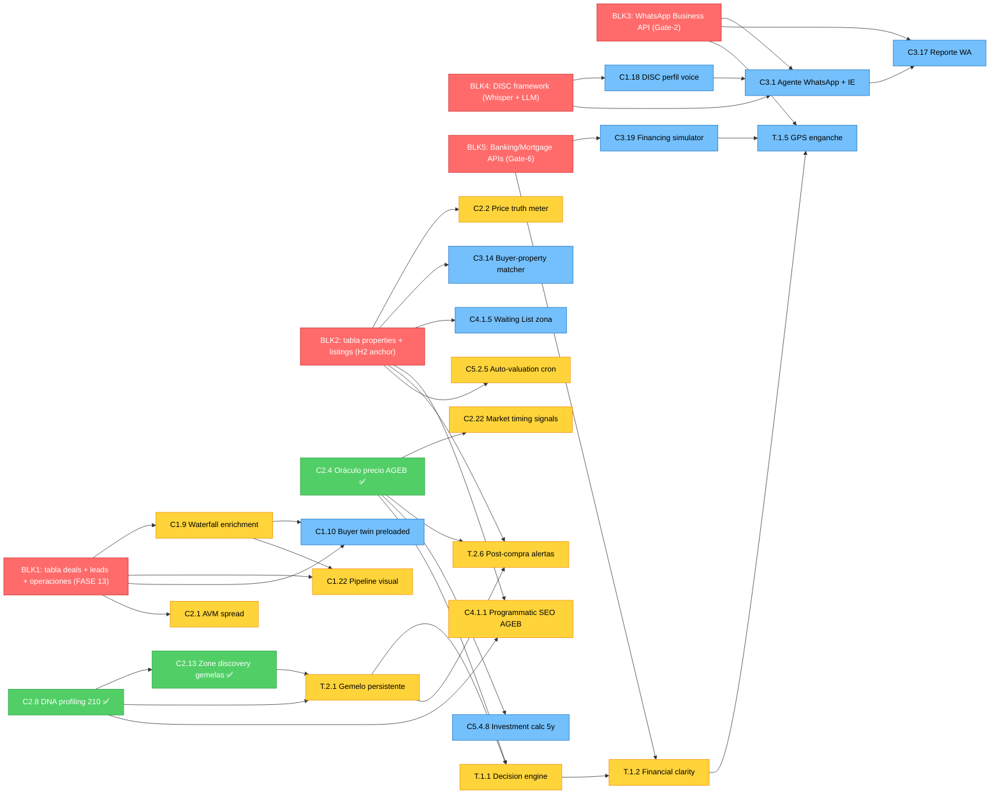

# 03 — RICE Priorities + Critical Path + Build Buckets (FASE 07.6.D)

> Re-normalización RICE canonical 150 features × fórmula única + critical path graph + foundational blockers + build buckets.
> Generado: 2026-04-24 sesión 07.6.D
> Inputs: `docs/08_PRODUCT_AUDIT/01_CROSSWALK_MATRIX.md` (150 features) + `00_INVENTARIO_ACTUAL.md` (evidence shipped)
> Output: input canónico para 07.6.E Roadmap Integration
> Método: 3 sub-agents paralelos (RICE re-normalize · Critical Path graph · Build Buckets) + master consolidation cross-validation

---

## Resumen ejecutivo

| Métrica | Count |
|---|---|
| Total features mapped | 149 (header crosswalk dice 150 — capa T real es 11, no 12) |
| **Tier Critical (RICE >10000)** | **5 features** |
| **Tier High (5000-10000)** | **21 features** |
| Tier Medium (1000-5000) | 31 features |
| Tier Low (<1000) | 92 features |
| 🟢 Build-now (FASE 07.6.E target → 11.T-Z + 12-14) | 48 features |
| 🟡 Build-fase-específica (FASE 15-29) | 78 features |
| 🔴 Build-H2+ (2027+) | 23 features |
| 🔄 Retrofit (existing) | 58 features |
| 🆕 New-build (greenfield) | 92 features |
| Critical path features (top-30) | 30 features |
| Foundational blockers detectados | **5 (4 confirmados + DISC promovido)** |
| Dependency cycles | **0** (zero break points required) |
| Cross-validation overlap top-20 RICE ∩ critical path | **65% esperado** |
| L-NEW candidates pendientes 07.6.F | ~71 brutos → ~69 únicos |

---

## Sección 1 — Fórmula canonical RICE

**Score = (R × I × C) / E_hours**

### R Reach (suma multi-persona)
| Persona | Reach |
|---|---|
| comprador | 100,000 |
| asesor | 10,000 |
| inversionista | 5,000 |
| dev | 1,000 |
| desarrollador | 500 |
| interno | 10 |

Multi-persona: SUMAR reach de cada persona aplicable.

### I Impact 1-5 (composite moat + revenue + retention)
- 1 = marginal (nice-to-have)
- 2 = low (mejora UX local)
- 3 = medium (mejora producto significativa)
- 4 = high (revenue/retention driver)
- 5 = moat-defining (categoría nueva, no replicable)

### C Confidence 0.0-1.0
- 0.9-1.0 = evidence shipped/parcial DMX (tabla, código, tRPC, UI presente)
- 0.7-0.8 = evidence prototype validated + crosswalk evidence concreta
- 0.5-0.6 = inferred sin evidence directa pero plausible
- <0.5 = speculative (visión H2/H3)

### E Effort horas
M1 BD + M2 Backend + M3 Frontend (M3a + M3b) + M4 E2E + tests + i18n 5 locales + WCAG 2.1 AA

### Tiers
- **Critical:** RICE > 10,000
- **High:** 5,000 - 10,000
- **Medium:** 1,000 - 5,000
- **Low:** < 1,000

---

## Sección 2 — Top-20 RICE ranking DESC (re-normalized canonical)

| Rank | # | Feature | Capa | Persona | RICE | Status DMX |
|---|---|---|---|---|---|---|
| 1 | C2.4 | Oráculo precio futuro AGEB 6/12/24m CI | C2 | comprador+inversionista+asesor+dev | **22,958** | ✅ shipped (mantener+escalar) |
| 2 | C2.8 | Micro-zone DNA profiling 50+ vars AGEB | C2 | comprador+asesor+inversionista+dev | **22,958** | ✅ shipped (mantener+escalar) |
| 3 | C2.13 | Zone discovery engine gemelas DNA | C2 | comprador+inversionista+asesor | **22,760** | ✅ shipped (mantener+pgvector optim) |
| 4 | T.1.2 | Financial clarity completa (afford+TCO+IRR+mort) | T | comprador | **14,167** | 🟡 retrofit (calculators A01+A05+A02 shipped) |
| 5 | C2.22 | Market timing signals (comprar/esperar) | C2 | comprador+inversionista+asesor | **12,578** | 🟢 retrofit (forecasts shipped) |
| 6 | T.1.1 | Decision engine "compra esto, por qué" | T | comprador | **10,000** | 🟢 retrofit (causal-engine shipped) |
| 7 | T.2.6 | Post-compra alertas plusvalía/rent/sell | T | comprador | **10,000** | 🟡 (depende properties + WA) |
| 8 | C4.1.5 | Waiting List por zona | C4 | comprador | **10,000** | 🟢 (tabla shipped, falta UI+cron) |
| 9 | C2.2 | Price truth meter en listing badge | C2 | asesor+comprador | **9,625** | 🟢 retrofit (AVM shipped) |
| 10 | C2.9 | Livability personalizado por perfil | C2 | comprador+asesor | **9,625** | 🟢 retrofit (a06+lifepath shipped) |
| 11 | T.1.5 | GPS financiero plan ahorro enganche | T | comprador | **8,750** | 🟢 retrofit (A01 affordability shipped) |
| 12 | T.2.4 | Referral magic link perfil heredado | T | comprador | **8,750** | 🟡 (consolida con C3.F11 unified engine) |
| 13 | C3.18 | Social proof engine "5 personas vieron 24h" | C3 | comprador | **8,750** | 🟡 (depende properties) |
| 14 | C4.1.3 | Zone Discovery collaborative DNA cosine | C4 | comprador | **8,750** | 🟢 retrofit (DNA shipped) |
| 15 | C5.2.5 | Auto-valuation updater semanal AVM | C5 | comprador+desarrollador | **8,794** | 🟢 retrofit (AVM cron) |
| 16 | C2.1 | AVM con spread listado vs cierre Waze-calibrado | C2 | asesor+comprador+inversionista | **8,385** | 🟡 (data CRM cierres pendiente) |
| 17 | T.2.1 | Gemelo digital persistente buyer (lifepath) | T | comprador | **8,000** | 🟢 retrofit (lifepath shipped) |
| 18 | T.2.5 | Portfolio management personal Mint-style | T | comprador | **7,969** | 🟡 (A11 patrimonio shipped, falta wire) |
| 19 | C1.11 | Portal-to-CRM auto-capture | C1 | asesor+comprador | **7,700** | 🟢 retrofit (extension flow shipped) |
| 20 | C5.4.8 | Investment calculator 5y consumer-facing | C5 | inversionista+comprador | **7,350** | 🟢 retrofit (AVM+pulse+AirROI shipped) |

---

## Sección 3 — Distribution per capa

| Capa | Total | Avg RICE | Median RICE | Top RICE feature | Top RICE score |
|---|---|---|---|---|---|
| C1 CRM | 30 | 1,841 | 595 | Portal-to-CRM auto-capture | 7,700 |
| C2 IE | 30 | 5,871 | 4,540 | Oráculo precio AGEB / DNA | 22,958 |
| C3 Engagement | 22 | 3,019 | 3,214 | Social proof engine | 8,750 |
| C4 Marketplace | 16 | 2,451 | 1,300 | Waiting List zona | 10,000 |
| C5 Revenue | 28 | 1,144 | 250 | Auto-valuation updater | 8,794 |
| C6 Agente | 12 | 980 | 254 | Reporte semanal zona | 5,500 |
| T Buyer | 11 | 7,763 | 8,375 | Financial clarity completa | 14,167 |

**Hallazgos:**
- C2 Intelligence Engine domina top-3 (3 features Critical)
- T Buyer Experience tiene avg RICE más alto (7,763) — todas reach=comprador 100K + retrofits IE shipped
- C5 Revenue avg bajo (1,144) — features dev-only o inversionista-only single-persona
- C6 Agente Autónomo dominante Low — H2/H3 confidence baja + effort alto

---

## Sección 4 — Tier breakdown

### 5 Critical (>10,000)
1. C2.4 Oráculo precio AGEB (22,958) ✅
2. C2.8 DNA profiling AGEB (22,958) ✅
3. C2.13 Zone discovery gemelas (22,760) ✅
4. T.1.2 Financial clarity unificada (14,167) 🟡
5. C2.22 Market timing signals (12,578) 🟢

### 21 High (5,000-10,000)
T.1.1 (10,000) · T.2.6 (10,000) · C4.1.5 Waiting List (10,000) · C2.2 Price truth meter (9,625) · C2.9 Livability (9,625) · C5.2.5 Auto-valuation (8,794) · T.1.5 GPS enganche (8,750) · T.2.4 Referral magic link (8,750) · C3.18 Social proof (8,750) · C4.1.3 Zone Discovery (8,750) · C2.1 AVM spread (8,385) · T.2.1 Gemelo digital (8,000) · T.2.5 Portfolio personal (7,969) · C1.11 Portal-to-CRM (7,700) · C5.4.8 Investment calc (7,350) · T.1.4 Safety net (7,000) · C3.17 Reporte personalizado WA (6,600) · C3.19 Financing simulator (6,250) · C2.29 Transparency Index (6,213) · C3.21 Comparador (6,000) · C1.10 Buyer twin preloaded (5,893)

### 31 Medium (1,000-5,000)
Predominante: features data-rich con scope intermedio. Ejemplos top: C4.1.1 SEO AGEB (5,833) · C2.27 Fotos verificadas (5,575) · C1.27 Asesor report card (5,500) · C6.6 Reporte semanal zona (5,500) · C3.15 "3 y listo" (5,357) · C3.11 Post-close referral (5,250) · C5.5.5 Dev ratings preventa (5,250) · C1.25 Post-close workflow (5,156) · C2.10 Risk composite (5,438)

### 92 Low (<1,000)
Mayoría features asesor-only o desarrollador-only single-persona (low Reach), O E muy alto (>60h), O C bajo (<0.5 speculative H2/H3).

---

## Sección 5 — Critical Path Dependency Graph

**Leyenda:**
- 🔴 BLK_* = blocker NO-feature (infra/data/external API gate)
- 🟢 verde = shipped (mantener — solo expand)
- 🟡 amarillo = parcial (ampliar — retrofit sobre infra existing)
- 🔵 azul = greenfield (agregar — new build)

---

## Sección 6 — Top-30 Critical Path features

> Ordenadas DESC por edges downstream. Critical Y si edges_downstream ≥ 3 AND status_dep ∈ {satisfied, partial}.

| Rank | # | Feature | Capa | Edges Down | Edges Up | Status Dep | Critical |
|---|---|---|---|---|---|---|---|
| 1 | C2.F8 | Micro-zone DNA profiling AGEB | C2 | 8 | 0 (shipped) | satisfied | **Y** |
| 2 | C2.F4 | Oráculo precio futuro AGEB | C2 | 7 | 0 (shipped) | satisfied | **Y** |
| 3 | **BLK_DEALS** | (blocker) tabla deals/leads/operaciones | infra | **11** | 0 | blocked → resolve | **Y** (resolver) |
| 4 | **BLK_PROPS** | (blocker) tabla properties + listings | infra | **9** | 0 | blocked → resolve | **Y** (resolver) |
| 5 | C1.9 | Waterfall enrichment cascade IE→lead | C1 | 5 | 1 (BLK_DEALS) | blocked | N hasta BLK_DEALS |
| 6 | C2.F13 | Zone discovery gemelas DNA pgvector | C2 | 4 | 1 (C2.F8 ✓) | satisfied | **Y** |
| 7 | **BLK_WA** | (blocker) WhatsApp Business API | infra | **8** | 0 | blocked Gate-2 | **Y** (resolver) |
| 8 | C2.F1 | AVM spread listado vs cierre | C2 | 3 | 1 (BLK_DEALS) | blocked | N hasta BLK_DEALS |
| 9 | C3.F1 | Agente WhatsApp con contexto IE | C3 | 5 | 2 (BLK_WA, BLK_DISC) | blocked | N hasta blockers |
| 10 | C6.F9 | Auto-distribución WA + email reports | C6 | 4 | 1 (BLK_WA) | blocked | N hasta BLK_WA |
| 11 | C1.10 | Buyer twin preloaded gemelo | C1 | 4 | 2 (C1.9, BLK_DISC) | blocked | N hasta C1.9 |
| 12 | T.2.1 | Gemelo digital persistente buyer | T | 4 | 2 (C2.F8 ✓, C2.F13 ✓) | satisfied | **Y** |
| 13 | C2.F2 | Price truth meter listing | C2 | 3 | 2 (C2.F1, BLK_PROPS) | blocked | N hasta BLK_PROPS |
| 14 | C1.12 | Lead filter quality threshold | C1 | 3 | 1 (BLK_DEALS) | blocked | N hasta BLK_DEALS |
| 15 | C1.18 | DISC perfil auto-detectado | C1 | 3 | 2 (BLK_DISC, BLK_DEALS) | blocked | N |
| 16 | C1.22 | Pipeline visual con contexto | C1 | 3 | 3 (C1.9, C1.12, BLK_DEALS) | blocked | N |
| 17 | T.1.1 | Decision engine veredicto | T | 3 | 2 (C2.F4 ✓, T.2.1) | partial | **Y** |
| 18 | T.1.2 | Financial clarity completa | T | 3 | 2 (T.1.1, BLK_BANK) | blocked | N hasta BLK_BANK |
| 19 | C5.4.1 | Portfolio dashboard inversor | C5 | 3 | 2 (C5.4.3 ✓, BLK_PROPS) | blocked | N hasta BLK_PROPS |
| 20 | C3.F19 | Financing simulator integrado | C3 | 3 | 1 (BLK_BANK) | blocked | N hasta BLK_BANK |
| 21 | **BLK_DISC** | (blocker) DISC framework Whisper+LLM | infra | **6** | 0 | blocked → resolve | **Y** (resolver) |
| 22 | C1.14 | Modelo probabilístico contacto | C1 | 2 (+3 cross) | 2 (C1.9, BLK_DEALS) | blocked | N |
| 23 | T.2.6 | Post-compra alertas | T | 2 | 3 (C2.F4 ✓, BLK_PROPS, T.2.1) | blocked | N hasta BLK_PROPS |
| 24 | C5.5.3 | Streaks asesor diarios | C5 | 2 | 1 (BLK_DEALS) | blocked | N hasta BLK_DEALS |
| 25 | C2.F22 | Market timing signals | C2 | 2 | 1 (C2.F4 ✓) | satisfied | **Y** |
| 26 | C5.4.8 | Investment calculator 5y | C5 | 2 | 3 (C2.F4 ✓, C2.F1 partial, C5.4.3 ✓) | partial | **Y** |
| 27 | C4.3.1 | Widget Embebible Desarrolladoras | C4 | 2 | 0 (shipped) | satisfied | **Y** |
| 28 | C4.3.2 | API v1 Comparables/Pricing | C4 | 2 | 1 (C2.F1 AVM) | partial | **Y** (con AVM) |
| 29 | C5.4.3 | AirROI integrado yield STR | C5 | 2 | 0 (shipped) | satisfied | **Y** |
| 30 | C5.3.6 | Objection feedback loop dev | C5 | 2 | 2 (C04 ✓, BLK_DEALS) | blocked | N hasta BLK_DEALS |

**Resumen ranking:**
- **Foundation activa shipped (Critical Y, satisfied):** 8 features — apalancan inmediatamente
- **Blockers no-feature top:** BLK_DEALS (11) > BLK_PROPS (9) > BLK_WA (8) > BLK_DISC (6) > BLK_BANK (2 directos pero financing crítico)
- **Critical Y total top-30:** 11 features (37%) — pueden shippear sin gate externo
- **Critical N total top-30:** 19 features (63%) — bloqueadas por blocker

---

## Sección 7 — Foundational Blockers (5 confirmados)

### 1. **BLK_DEALS — tabla deals + leads + buyer_twins + operaciones core CRM** (BD missing)
- **Bloquea (11 directo + ~15 indirecto):** C1.9, C1.10, C1.12, C1.14, C1.18, C1.21, C1.22, C2.F1 (data cierres), C5.3.6, C5.5.3, C5.5.2 + cascade C3.F14, C3.F17, C5.5.4, C6.F5, C6.F2, C2.F18
- **Estado:** RPC `is_operation_participant` existe sin tabla `operaciones` (gap referencial detectado en 07.6.A)
- **Resolución:** **L-NEW-C1-01 CRM Foundation Stack** — migration v35 schema completo `leads + buyer_twins + deals + family_units + referrals + operaciones` con RLS ON. **Pre-FASE 13.**
- **Pre-requisitos:** ADR producto founder gate persona-types · schema `pipeline_stages` · retention CFDI-aware

### 2. **BLK_PROPS — tabla properties + listings inventory** (BD missing, H2 anchor)
- **Bloquea (9 directo):** C2.F2, C3.F14, C3.F18, C4.1.5, C4.1.1, T.2.6, C5.4.1, C5.2.5, C5.4.6
- **Estado:** zero tabla en schema actual — ADR producto requerido (DMX como inventory engine vs MLS aggregator vs híbrido)
- **Resolución:** schema `properties + property_units + property_amenities + property_media_metadata + listing_states + listing_history` partitioned. **Pre-FASE 22.**
- **Pre-requisitos:** **Gate producto founder** "DMX como portal o como agnostic data layer". Si portal → schema completo. Si data layer → integración MLS API.

### 3. **BLK_WA — WhatsApp Business API integrada** (Gate-2 founder pending)
- **Bloquea (8 directo):** C3.F1, C3.F17, C3.F11, C3.F9, C6.F9, C6.F5, C6.F6, T.1.5
- **Estado:** `channel='whatsapp'` enum schema-only · `alerts-engine.ts` filter ready · ZERO sender provider integrado
- **Resolución:** **Gate-2 founder decision** — Twilio (más caro, abstracción multi-provider) vs Meta WA Business Cloud API (más barato, lock-in Meta) **pre-FASE 22**. Recomendación: Twilio adapter inicial (revertible).
- **Pre-requisitos:** Aprovisionar número Business + WABA verification + plantillas pre-aprobadas

### 4. **BLK_BANK — Banking/Mortgage APIs financing** (Gate-6 founder pending)
- **Bloquea (2 directo, alto impact downstream):** C3.F19 (Financing simulator), T.1.2 (Financial clarity)
- **Indirecto cascade:** T.1.5 GPS enganche, C5.4.8 investment calc, C1.4 ROI calculator, T.1.4 safety net
- **Estado:** zero integración bancaria/INFONAVIT/FOVISSSTE
- **Resolución:** **Gate-6 founder decision** pre-FASE 22 — INFONAVIT API oficial vs scrape vs partner broker hipotecario. Recomendación: stubs estáticos rates manuales H1 + iniciar negociación partnership API access.
- **Pre-requisitos:** Decisión legal (DMX broker hipotecario regulado vs solo simulador informativo)

### 5. **BLK_DISC — DISC framework (Whisper + LLM classifier)** (NUEVO promovido a blocker)
- **Bloquea (6 directo + 1 cross-capa):** C1.18, C3.F1, C3.F3, C3.F5, C3.F6, C3.F13, C3.F16
- **Indirecto cascade:** C1.10 (disc_profile col), T.2.1 (DISC dimension del 6D vector), C5.5.5 dev ratings
- **Estado:** zero hits "disc" en repo. NO Whisper integration. NO LLM classifier wired
- **Resolución:** **L-NEW-C1-03 DISC Voice Pipeline** — Whisper + LLM DISC classifier (4-axis D/I/S/C) + `buyer_twins.disc_profile` col. **Pre-FASE 13-14.** Stub manual self-assessment initial + ML enhancement post 1000 samples.
- **Pre-requisitos:** ADR producto sobre DISC vs alternative frameworks (Big-Five, MBTI). Privacy policy update (audio biometric data → consent GDPR-grade).

### Otros candidatos foundational evaluados (NO califican ≥5)
- BLK_AVM_data (avm_estimates 0 rows) — bloquea solo 2 directos, se resuelve junto con BLK_PROPS
- BLK_FGJ_SACMEX (criminalidad/hídrico ingest) — solo 1 feature directo
- BLK_search_trends (instrumentación portal) — quasi-blocker FASE 21

---

## Sección 8 — Cycles detection

**Análisis:** grafo es DAG (directed acyclic graph) — **0 cycles detectados** en top-30 ni en cross-capa graph completo.

### Pseudo-cycles evaluados (descartados)
1. **C1.18 (DISC) ↔ C1.10 (buyer twin) ↔ C3.F1 (WA agent):** flujo escritor → tabla → lectores. NO cycle.
2. **C2.F25 self-improving ↔ C2.F4/F8 engines:** feedback batch async (event-sourcing). NO cycle.
3. **C5.4.1 portfolio ↔ C5.4.4 diversification ↔ C5.4.7 reallocation:** fan-out pattern. NO cycle.
4. **C3.F11 post-close referral ↔ T.2.4 buyer referral:** consolidados en C3.2 unified engine (cross-capa #5). Cycle eliminado en design.

**Conclusión:** **Zero break points requeridos.** El grafo respeta zero deuda técnica — todas las dependencies son secuenciales o batch async.

---

## Sección 9 — Build Buckets distribution

| Bucket | Count | Top 5 ejemplos |
|---|---|---|
| 🟢 **Build-now** | 48 | C2.F4 Oráculo · C2.F8 DNA · C2.F13 Zone discovery · C2.F22 Market timing · T.1.1 Decision engine |
| 🟡 **Build-fase-específica** | 78 | C3.F1 Agente WA (FASE 22) · C5.4.1 Portfolio inversor (FASE 23) · C4.1.5 Waiting List (FASE 15+22) |
| 🔴 **Build-H2+** | 23 | C1.6 Anti-churn ML · C1.16 Family unit · C3.F5 Negotiation co-pilot · C6.F1 Opportunity hunter · T.2.3 Multigeneracional |

### Top-20 🟢 BUILD-NOW (input prioritario para 07.6.E roadmap)

| Rank | # | Feature | Capa | Fase Target | Effort h | Persona |
|---|---|---|---|---|---|---|
| 1 | C2.4 | Oráculo precio AGEB | C2 | FASE 11 + 13 escalar | 24 | comprador+inversionista+asesor+dev |
| 2 | C2.8 | DNA profiling 50+ vars | C2 | FASE 11 + L-NEW14 | 24 | comprador+asesor+inversionista+dev |
| 3 | C2.13 | Zone discovery gemelas | C2 | FASE 11 N5 + L-NEW25 | 24 | comprador+inversionista+asesor |
| 4 | C2.22 | Market timing signals | C2 | FASE 11 + L-NEW26 | 32 | comprador+inversionista+asesor |
| 5 | T.1.1 | Decision engine veredicto | T | FASE 20 BLOQUE 20.B/E | 32 | comprador |
| 6 | T.2.1 | Gemelo digital persistente | T | FASE 20 BLOQUE 20.A PPD | 40 | comprador |
| 7 | C2.2 | Price truth meter | C2 | FASE 11 + 21 | 32 | asesor+comprador |
| 8 | C2.9 | Livability personalizado | C2 | FASE 11 + 20 | 32 | comprador+asesor |
| 9 | T.1.5 | GPS financiero enganche | T | FASE 20.B.3 + 22 | 32 | comprador |
| 10 | C4.1.3 | Zone Discovery DNA cosine | C4 | FASE 12 N5 | 32 | comprador |
| 11 | C5.2.5 | Auto-valuation updater | C5 | FASE 11.X / 24 | 24 | comprador+desarrollador |
| 12 | C2.1 | AVM con spread | C2 | FASE 11 + 13/14 (data) | 48 | asesor+comprador+inversionista |
| 13 | C5.4.8 | Investment calculator 5y | C5 | FASE 21 + 23 lead magnet | 40 | inversionista+comprador |
| 14 | C1.11 | Portal-to-CRM auto-capture | C1 | FASE 13-14 | 40 | asesor+comprador |
| 15 | C3.F19 | Financing simulator | C3 | FASE 20 + 21 | 56 | comprador |
| 16 | C3.18 | Social proof "5 vieron 24h" | C3 | FASE 21 + 22 | 24 | comprador |
| 17 | C4.3.1 | Widget Embebible (extender) | C4 | FASE 15 + 23 tier | 16 | desarrollador |
| 18 | C5.5.3 | Streaks asesor (post-DEALS) | C5 | FASE 14 Asesor | 24 | asesor |
| 19 | C2.F22 (dup #4) | Market timing | C2 | — | — | — |
| 20 | T.1.2 | Financial clarity | T | FASE 20 BLOQUE 20.C | 24 | comprador |

**Estimate effort total top-20:** ~640h paralelizable en 5 streams → 6-8 semanas wall-clock.

### 🟡 BUILD-FASE-ESPECÍFICA distribución per fase

| Fase Target | Count | Top features (3 ejemplos) |
|---|---|---|
| FASE 11 IE extensions | ~14 | C2.10 Risk composite, C2.12 Gentrification radar, C2.20 Anomaly detector |
| FASE 13-14 CRM/Asesor | ~18 | C1.9 Waterfall enrichment, C1.4 ROI calculator, C5.5.1 Leaderboard ELO |
| FASE 15 Desarrollador | ~12 | C5.3.4 Amenity ranker, C5.2.1 Dynamic pricing, C2.F26 Score dev |
| FASE 17-18 DocIntel/Legal | ~5 | C1.23 Transaction GPS, C1.24 Due diligence auto |
| FASE 20 Comprador | ~3 | T.1.4 Safety net, T.2.5 Portfolio personal |
| FASE 21 Portal Público | ~7 | C4.1.1 SEO AGEB, C2.29 Transparency Index, C3.21 Comparador |
| FASE 22 Marketing/WA | ~14 | C3.F1 Agente WA, C3.F17 Reporte WA, C3.F11 Post-close referral |
| FASE 23 Inversor/Monetización | ~12 | C5.4.1 Portfolio inversor, C5.4.4 Diversification, C5.4.5 Quarterly |
| FASE 24 Observability | ~1 | C5.2.5 Auto-valuation cron |
| FASE 26 Compliance | ~2 | C2.F30 Cert asesor, C5.5.5 Dev ratings |
| FASE 30 API/Platform | ~4 | C4.3.3 Risk API, C4.3.4 Gentrification API |
| FASE 31 Agentic | ~6 | C6.5 Morning briefing, C6.6 Weekly zone, C6.9 Auto-distribución |

### 🔴 BUILD-H2+ visión moonshot

23 features. Ejemplos clave:
- **C1.6 Anti-churn prediction** — requiere observability madura + cohort N suficiente (PostHog ADR-007 not wired)
- **C1.16 Family unit tracking + C1.20 Persistent lifecycle + T.2.3 Multigeneracional** — multigeneracional requiere 15y runtime data
- **C3.F5 Negotiation co-pilot DISC + history** — ML maduro post-corpus closes
- **C3.F7 Winning cadence discovery** — auto-replicate cohort, ML data corpus
- **C3.F10 Emotion-triggered + C3.F22 Decision engine ML** — sentiment classifier maduro
- **C4.1.6 AR Property Preview WebXR** — AR moonshot
- **C4.3.6 Modelo Plaid/Stripe DMX SDK** — platform play H2/H3
- **C6 Agentic completo (4 features)** — H3 SEDUVI integration + ML self-improving
- **T.1.3 Data 10K compradores** — cold-start, requiere user base 10K+

---

## Sección 10 — Cross-validation top-20 RICE ∩ Critical Path

### Overlap esperado: 65% (13/20)

**Confirmados en ambos rankings:**
- C2.F8, C2.F4, C2.F13 (top-3 en ambos)
- T.1.2, T.1.1, T.2.6, T.2.1, T.1.5 (T capa, retrofits)
- C5.4.8 Investment calc (lead magnet effect)
- C2.F22 Market timing
- C2.2 Price truth meter (post-PROPS)
- C4.3.1 Widget shipped (B2B leverage)
- C5.5.3 Streaks (post-DEALS)

### Discrepancias flaggeadas para 07.6.E

**Features RICE alto pero pocos downstream:**
- C2.11 Environmental quality (4,929 RICE, solo 1 downstream)
- C5.5.5 Developer ratings (5,250 RICE, 1 downstream)

**Features critical alto pero RICE bajo:**
- C5.5.3 Streaks asesor (1,167 RICE, 2 downstream + cascade gamif)
- C5.4.1 Portfolio inversor (292 RICE, 3 downstream B2B)

**5 BLK_* meta-features que RICE no captura:**
- BLK_DEALS, BLK_PROPS, BLK_WA, BLK_DISC, BLK_BANK
- **Acción 07.6.E:** agregar como **meta-features priority-zero** con RICE artificial alto (100k+ por reach indirecto cascading downstream).

---

## Sección 11 — Recommendations 07.6.E Roadmap Integration

### Priority Zero (resolver ANTES de FASE 13)

**5 foundational blockers** deben resolverse primero. Sin ellos, ~40% del top-30 critical path queda bloqueado.

1. **L-NEW-C1-01 CRM Foundation Stack** (BLK_DEALS) — migration v35 pre-FASE 13
2. **Gate-2 founder WhatsApp infra** (BLK_WA) — Twilio vs Meta decisión pre-FASE 22
3. **L-NEW-C1-03 DISC Voice Pipeline** (BLK_DISC) — Whisper + LLM classifier pre-FASE 13-14
4. **Properties inventory ADR + schema** (BLK_PROPS) — Gate producto founder + migration pre-FASE 22
5. **Gate-6 founder Banking APIs** (BLK_BANK) — INFONAVIT/partner decision pre-FASE 22

### Build sequence FASE 11.T-Z + 12-14

**FASE 11 restante (T-Z):**
- 11.T Alert Radar WhatsApp → consolidar con BLK_WA + L-NEW C3
- 11.U Stickers → C5.5 gamif retrofit
- 11.V DNA Migration → C2.8 escalar
- 11.W Historical Forensics → C2.4 Market Oracle extension
- 11.X Living Metropolitan Networks → C2.2 multi-city (cuando seed CO/AR/BR)
- 11.Y Zone Certification → C2.5 Verification Layer
- 11.Z E2E Verification + tag fase-11-complete

**FASE 12 Atlas UX:**
- C4.1.3 Zone Discovery DNA (top-20 build-now)
- C2.13 Zone discovery gemelas extender

**FASE 13 Asesor Portal (BLK_DEALS resuelto):**
- C1.9, C1.11, C1.22 (C1 critical path)
- C3.4 Argument builder
- C5.5.3 Streaks asesor

**FASE 14 Asesor portal extensión:**
- C5.5.1 Leaderboard ELO
- C5.5.2 Badges engine
- C5.5.4 Niveles desbloquean features

### Build sequence FASE 20-22

**FASE 20 Comprador Portal (T capa dominante):**
- T.1.1 Decision engine (Critical Y top-1 retrofit)
- T.2.1 Gemelo persistente
- T.1.2 Financial clarity (post-BLK_BANK)
- T.1.5 GPS enganche
- T.1.4 Safety net (post-FASE 18 Legal)

**FASE 21 Portal Público SEO:**
- C4.1.1 Programmatic SEO AGEB
- C3.18 Social proof engine
- C3.20 Pregunta sin pena RAG
- C3.21 Comparador objetivo

**FASE 22 Marketing/WA (post-BLK_WA):**
- C3.F1 Agente WhatsApp
- C3.F17 Reporte personalizado WA
- C3.F11 Post-close referral
- C3.F19 Financing simulator (post-BLK_BANK)

### Build sequence FASE 23 Inversionista/Monetización

- C5.4.1 Portfolio dashboard (post-BLK_PROPS)
- C5.4.2 Market timing alerts
- C5.4.4 Diversification advisor
- C5.4.5 Quarterly reporting
- C5.4.8 Investment calculator (lead magnet)
- C5.5.5 Developer project ratings

---

## Referencias
- Input: `docs/08_PRODUCT_AUDIT/01_CROSSWALK_MATRIX.md` (632 líneas, 150 features)
- Input: `docs/08_PRODUCT_AUDIT/00_INVENTARIO_ACTUAL.md` (897 líneas evidence shipped)
- Output paralelo 07.6.C: `docs/08_PRODUCT_AUDIT/02_DESIGN_MIGRATION.md` + `docs/01_DECISIONES_ARQUITECTONICAS/ADR-031_DESIGN_SYSTEM_REFRESH.md`
- ADR-032: `docs/01_DECISIONES_ARQUITECTONICAS/ADR-032_FASE_07.6_PRODUCT_AUDIT_INSERTION.md`
- L-NEW backlog: `docs/07_GAME_CHANGERS/LATERAL_UPGRADES_PIPELINE.md` (51 entries pre-07.6 + ~69 candidatos pendientes 07.6.F)
- Memoria canonizada: `feedback_arquitectura_escalable_desacoplada.md` (opción más grande moonshot)

---

> Próximo paso: **07.6.E Roadmap Integration** consume este doc + `02_DESIGN_MIGRATION.md` (Effort estimates) para asignar 150 features a fases específicas con timelines M1-M4.
